## Szymon Mateusz Zych 402734 Lab05

#### Cel: System pod uruchomienie, instalacja nienadzorowana

### Wymagania:
 - artefakt z poprzednich zajęć
 - WinSCP
 - Virtualbox
 - Fedora

## Instalacja
Zainstalowanie obrazu Fedory 36 netinstall z wybranymi opcjami:

#### Partycja
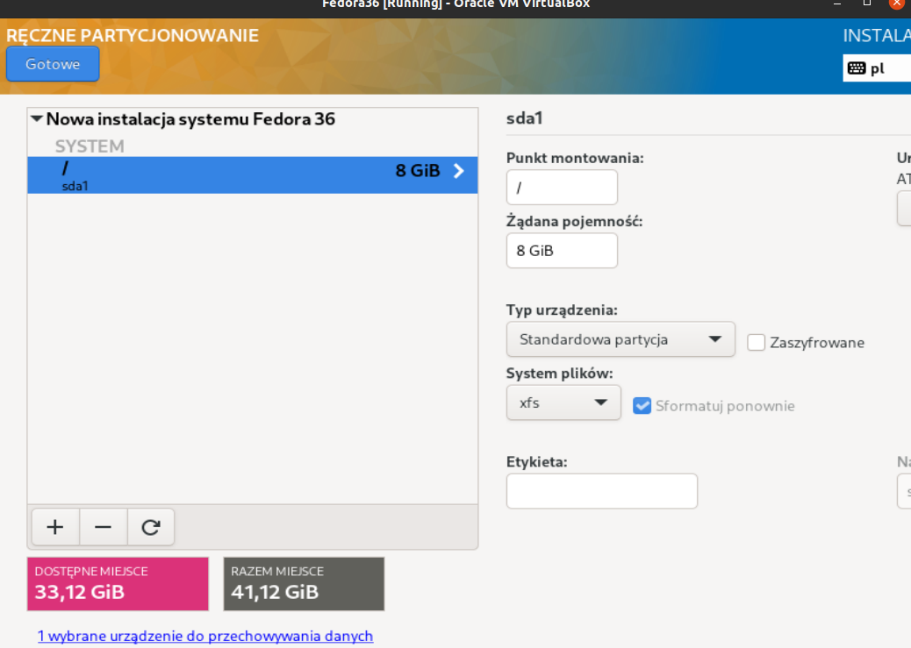

#### Root
Włącznie ssh jest ważnym krokiem
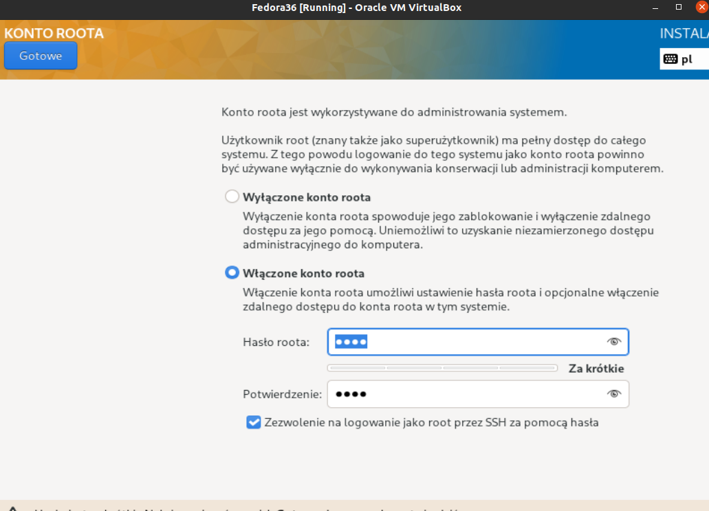

#### Nazwa
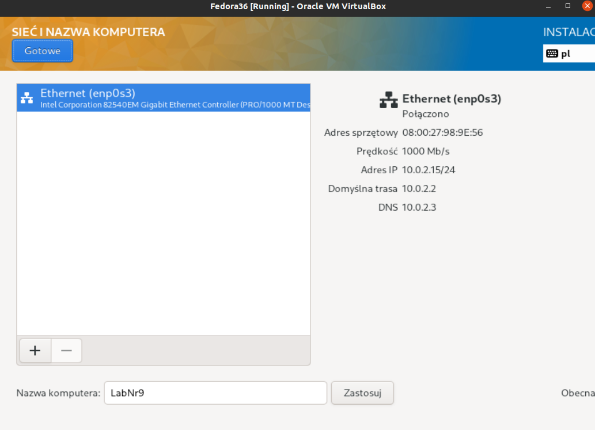

#### Środowisko
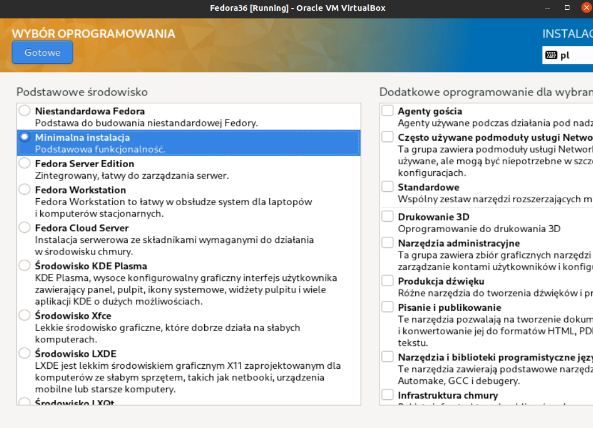

### Po Instalacji
Sprawdzam adres IP aby połączyć się poprzez WinSCP i pobrać plik anaconda-ks.cfg.
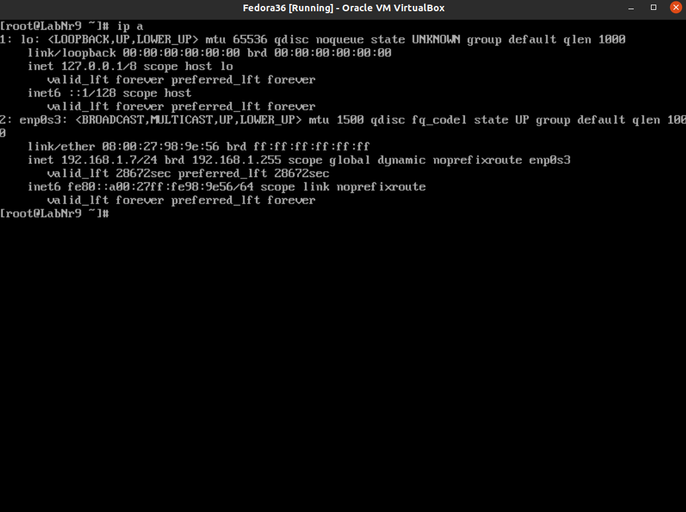

## Serwer
Stworzono taką samą maszynę wirtualna z obrazem, jedyna różnica to nazwa która została przyjęta jako "serwer".

#### Instalacja httpd

#### Wyjątki w zaporze
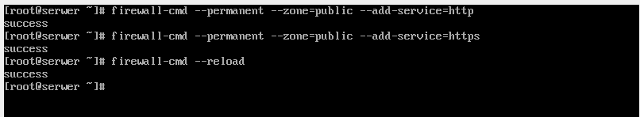

#### Włączenie usług
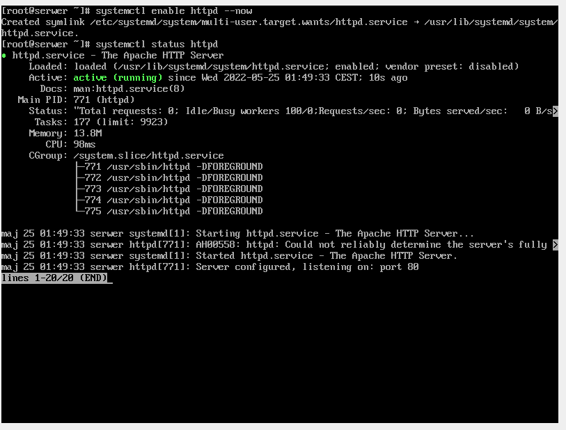

#### Sprawdzenie adresu i przesłanie artefaktu WinScp
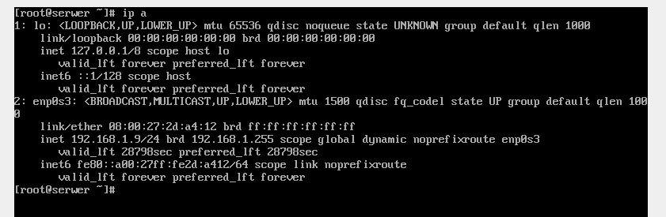

#### Utworzenie katalogu i skopiowanie artefaktu (wget)

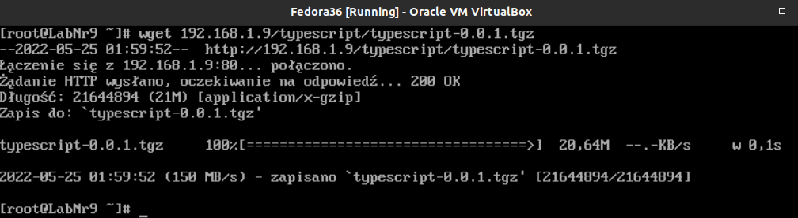

#### Instalacja npm
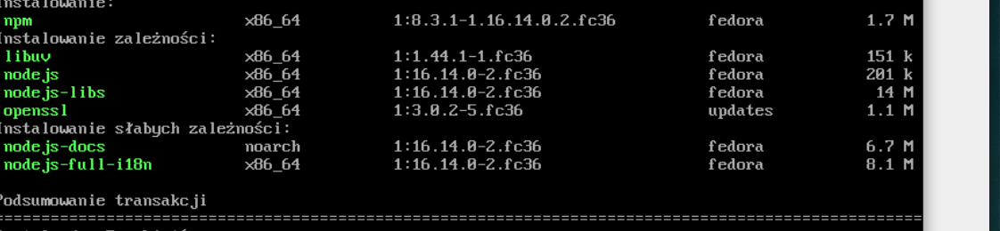
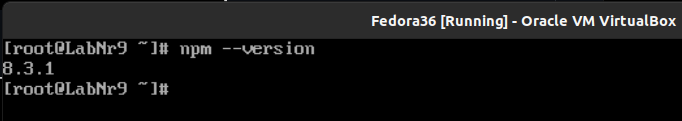

#### Instalacja programu 
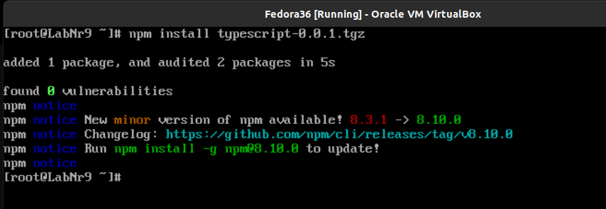

## Instalacja Nienadzorowana

Wymagany aktualnie bedzie plik anaconda-ks.cfg i przesyłamy go do repo na githubie. W pliku który wysyłamy na repo zostały dokonany zmiane typu dodanie seksji post w ktorej pobieramy artefakt z serwera, instalacja potrzebnych pakietow, repo Fedory oraz zamiana instalacji graficznej na tekstową.

#### Przed instalacja
Sprawdzamy czy w maszynie został utworzony dysk wiekszy niż deklarowany w pliku cfg 

#### Uruchomienie instalacji 
Wykorzystano link z githuba
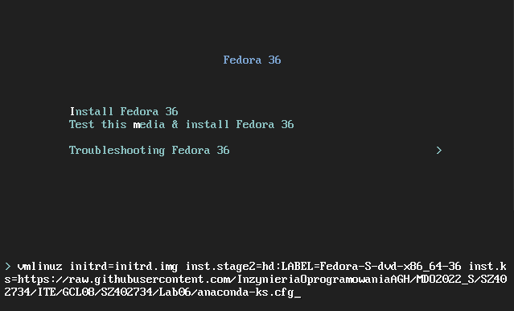

## Infrastructure as a code

#### Zamontowanie obrazu Fedory
#### Uwrozenie katalogu oraz zamontowanie w obrazu
#### Utworzenie katalogu roboczego i skopiowanie obrazu
#### Skopiowanie anaconda
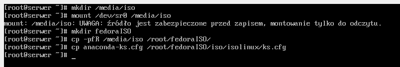

#### Modyfikowanie pliku isolinux.cfg
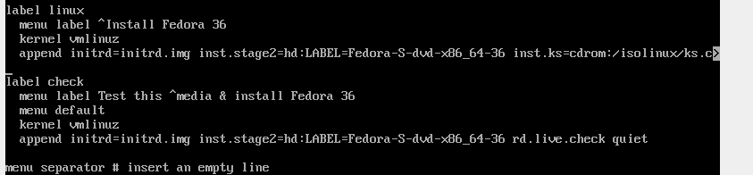

#### Instalacja pakietu
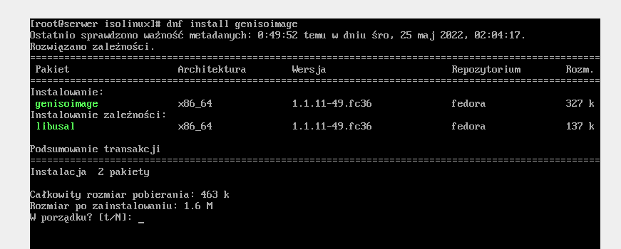

#### Stworzenie nowego ISO oraz pobranie obrazu WinScp oraz reczna instalacja na marzynie 
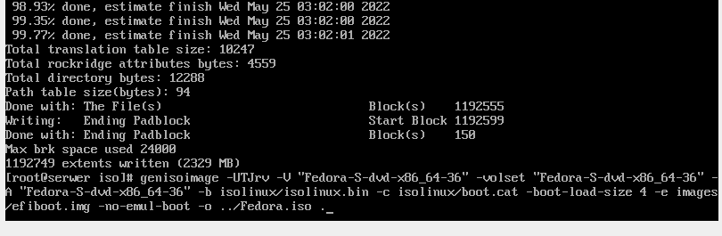
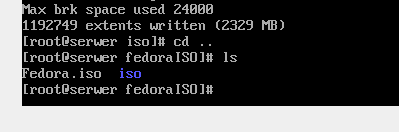
