## Sprawozdanie Lab11/12 
## Szymon Mateusz Zych 302734 ITE-GCL08
 

## Cel: Wdrażanie kontenery Kubernetes
 

## Kubernetes instalacja 
Pobieram potrzebne narzędzia albo sprawdzam cy je posiadam w tym przypadku "curl". Pobranie i instalacja "minikube".

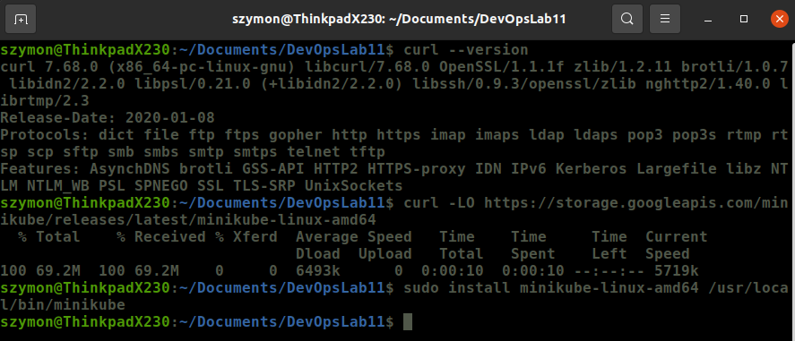

## Pakiety instalacyjne oraz sprawdzenie sumy kontrolnej
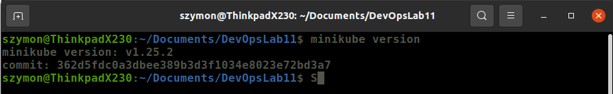
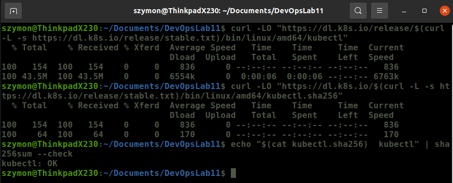

## Instalacja kubectl
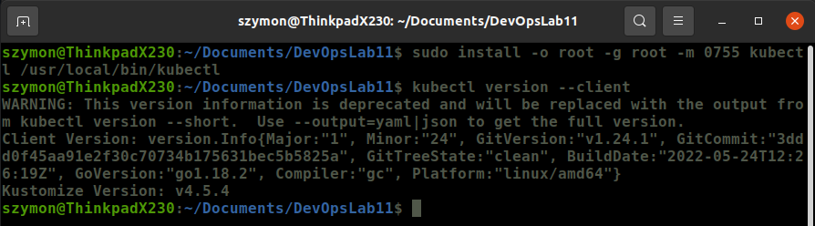

## Uruchomienie minikube
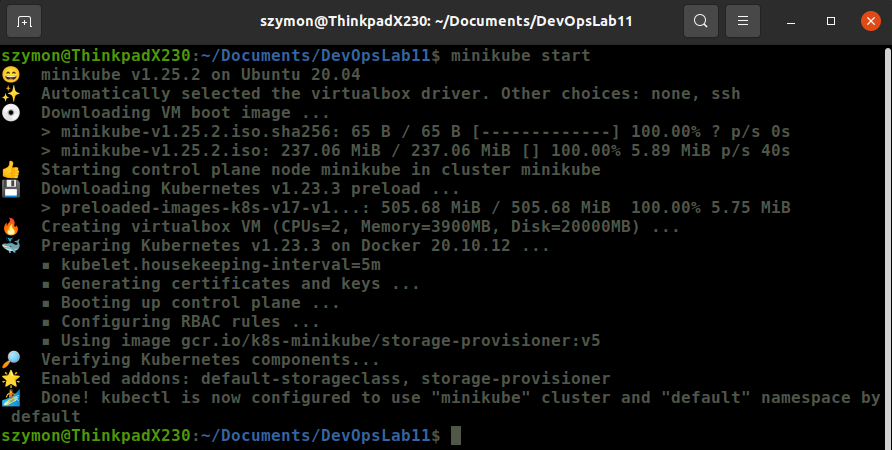

## Wersja
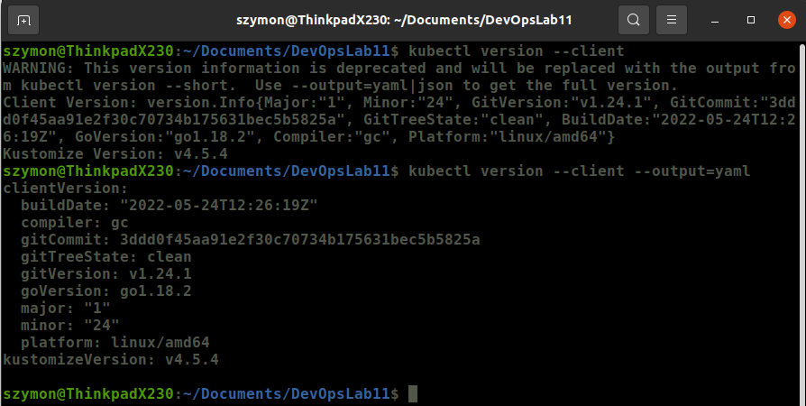

## Node i Pod
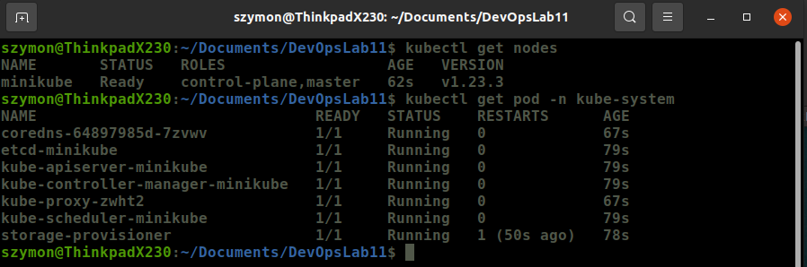

## Dashboard start
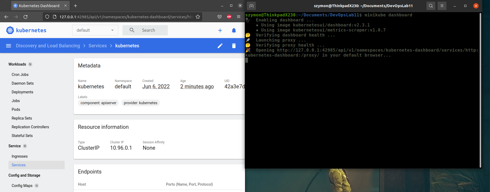

## Analiza posaidanego kontenera
Aplikacja została zmieniona ze względu na brak wyprowadzanych portów. 
Stworzony Dockerfile:
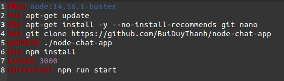

## Build aplikacji
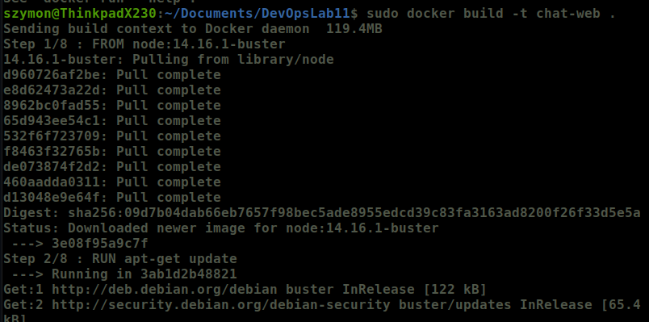

### Wrzucenie obrazu na dockerhub
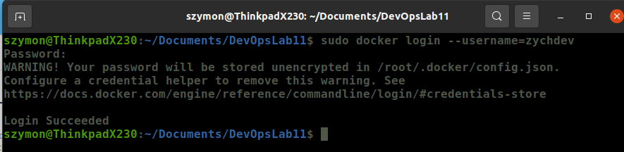
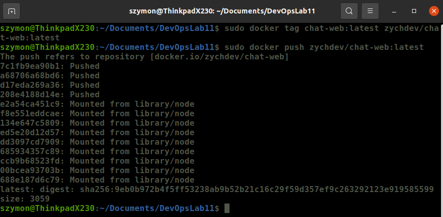

### Wykazanie ze aplikacja pracuje jako kontener
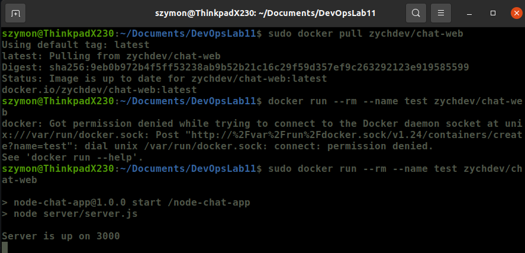

## Start oprogramowania
Uruchomienie na stosie k8s
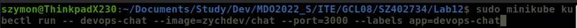

## Działanie
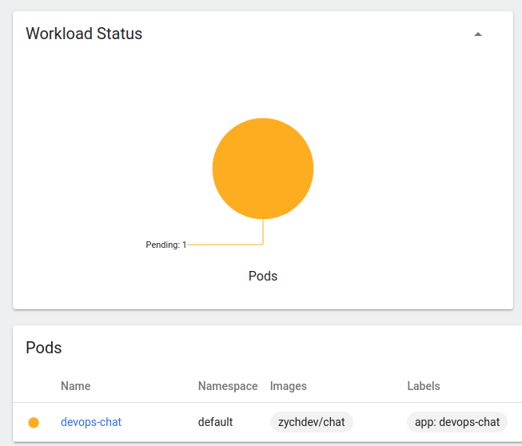
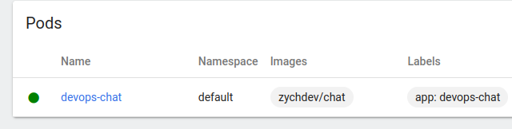
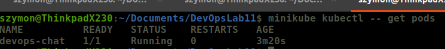
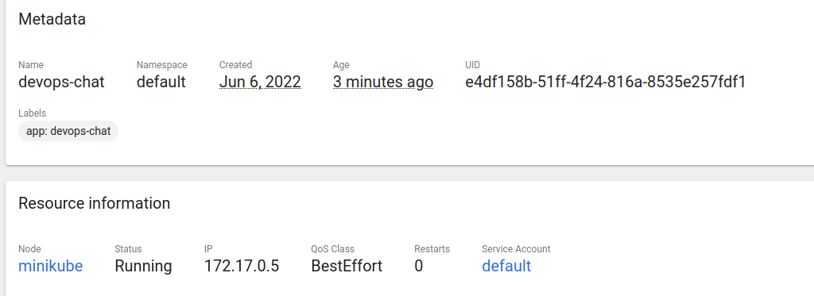

## Wyprowadzenie portu,komunikacja,plik wdrożenia
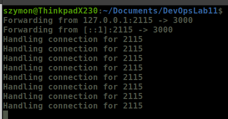
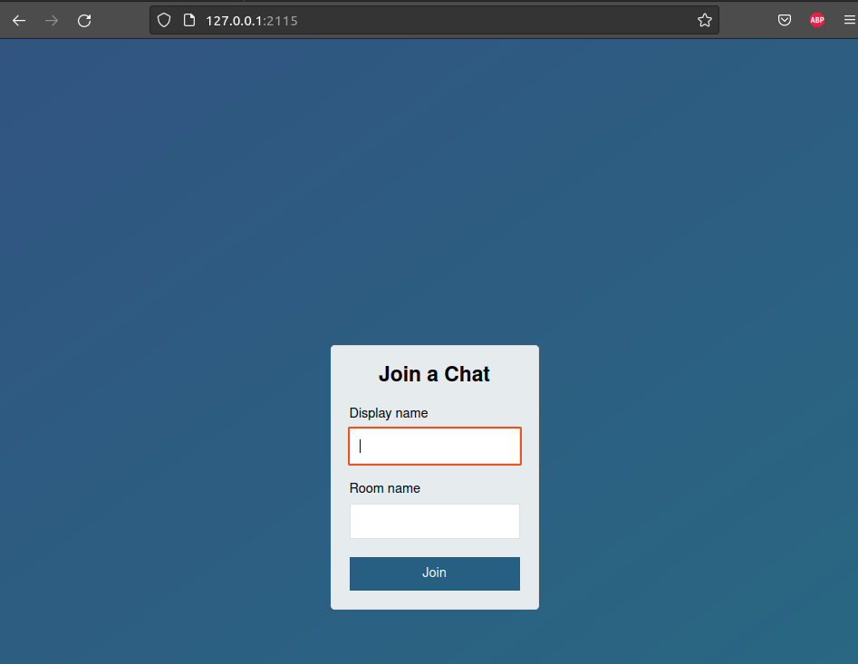
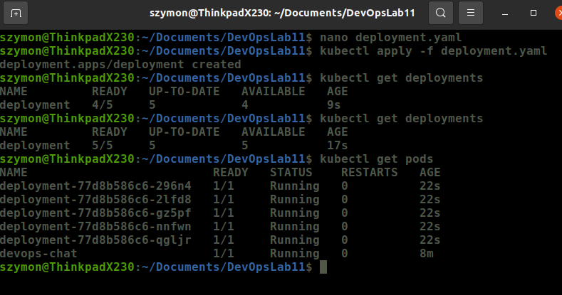
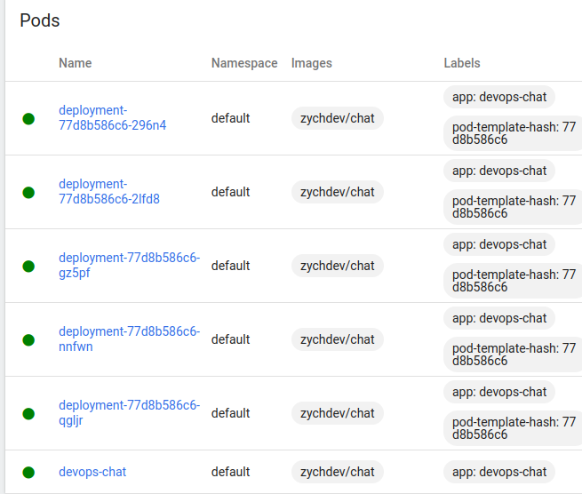
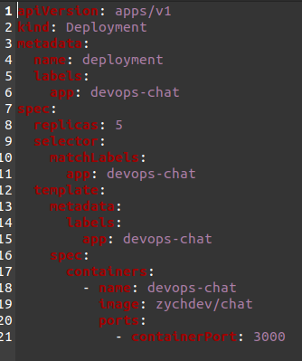

