| Imie   | Nazwisko | Data       |
|--------|----------|------------|
| Tomasz | Gąsior   | 09.03.2022 |

# 1. Instalacja klienta Git
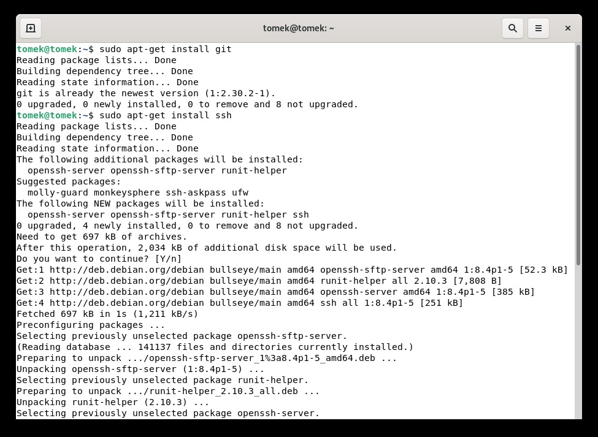
# 2. Klonowanie repozytorium za pomocą HTTPS
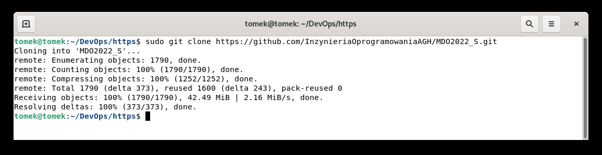
# 3. Generowanie klucza oraz klonowanie repozytorium za pomocą protokołu SSH

1. Generowanie klucza 

Klucz został wygenerowany zgodnie z dokumentacją github.
[Link](https://docs.github.com/en/authentication/connecting-to-github-with-ssh/generating-a-new-ssh-key-and-adding-it-to-the-ssh-agent)

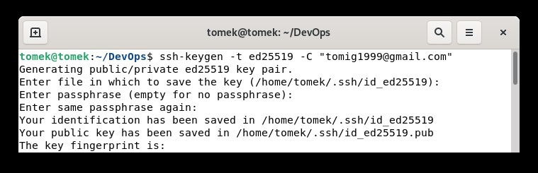

2. Dodanie klucza do Github 

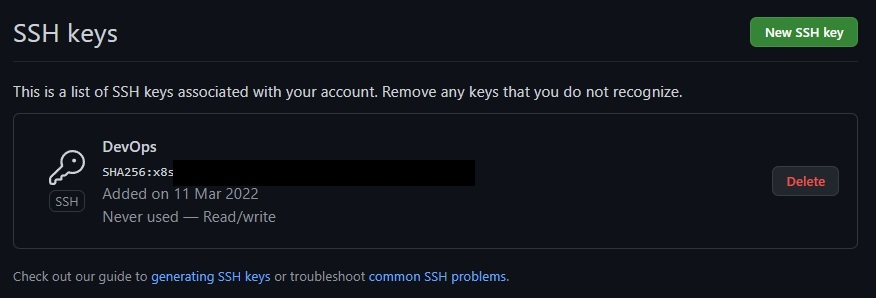

3. Test połączenia

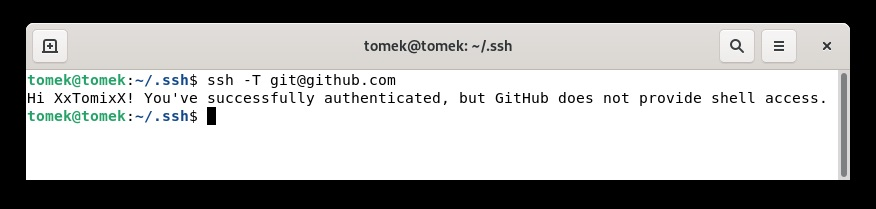

4. Pobranie repozytorium

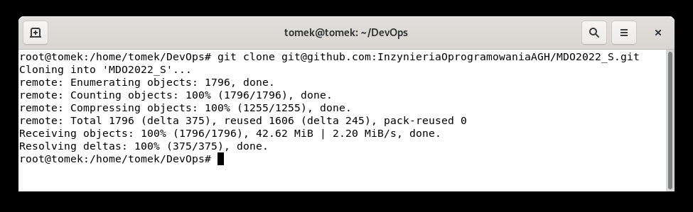

# 4.  Przełączenie się na gałąź main, a potem na gałąź swojej grupy 

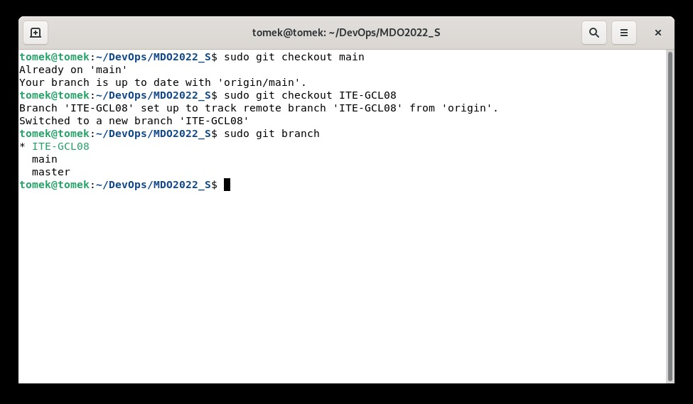

# 5. Tworzenie gałęzi o nazwie TG400423 oraz przełączenie się na nią 

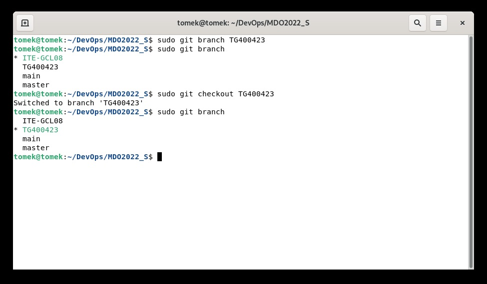

# 6. Tworzenie struktury plików w folderze grupy

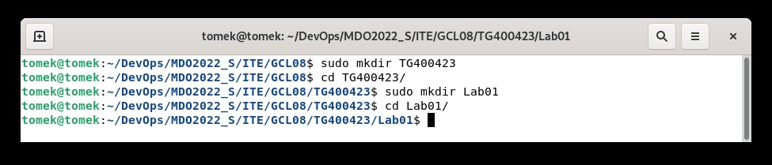

# 7. Dodanie plików ze sprawozdaniem 

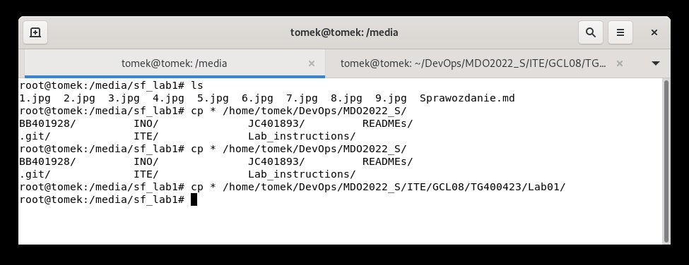

# 8. Sprawdzenie struktury plików

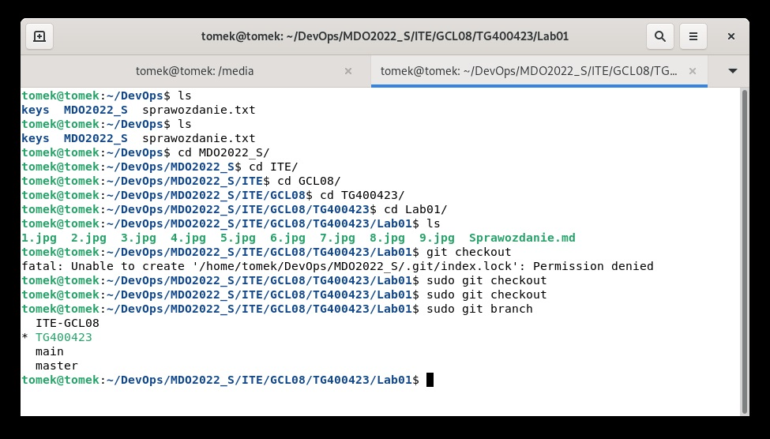

# 9. Wysyłanie zmian do zdalnego źródła

1. git add *

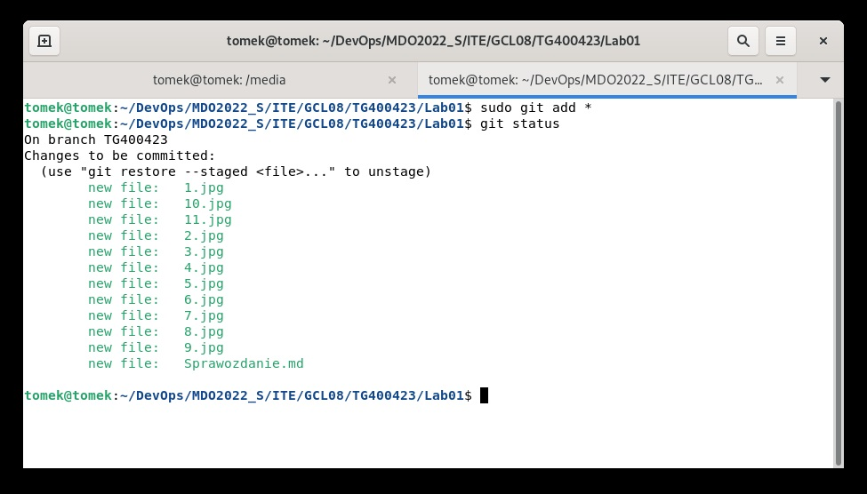

2. git commit

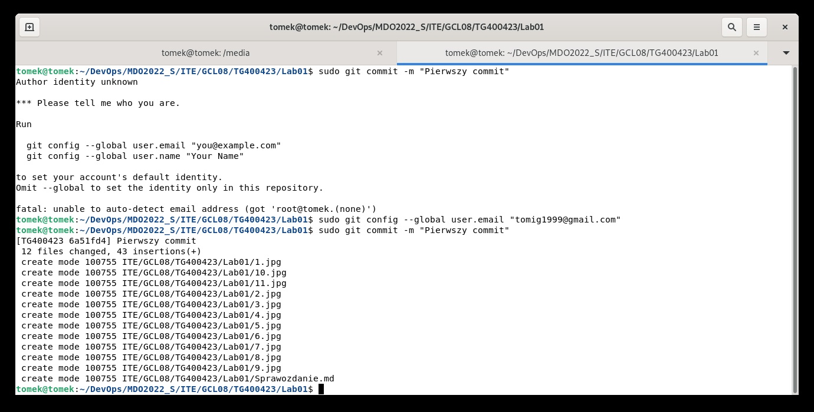

3. git push

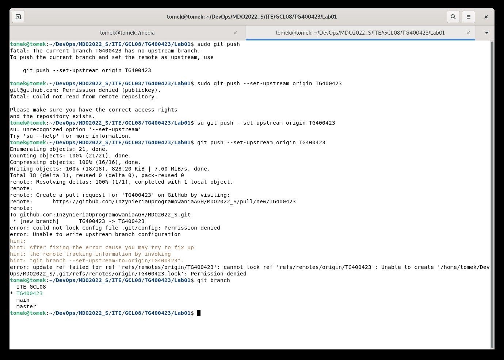

# 9. Aktualizacja sprawozdania o krok 6.7

