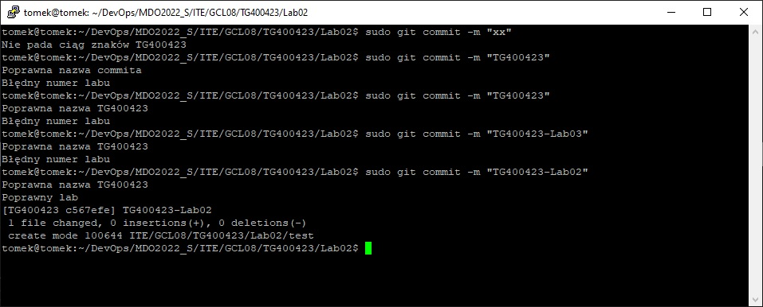
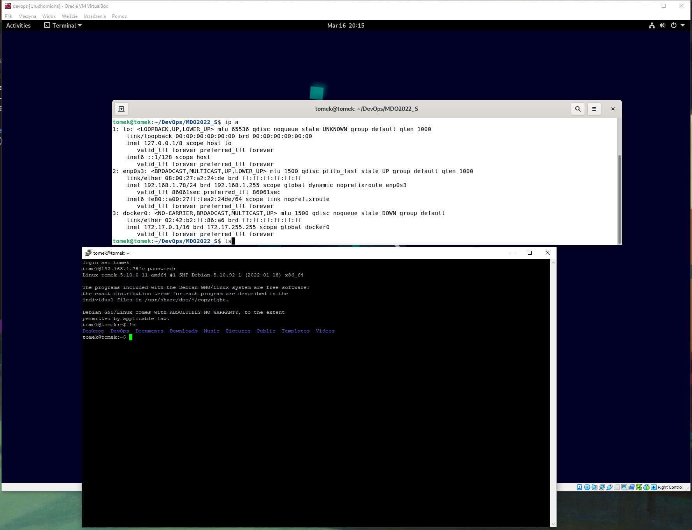
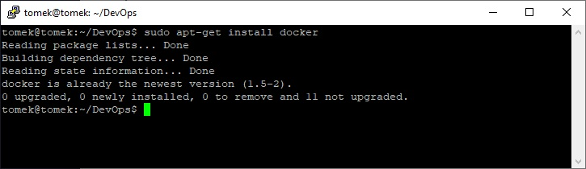
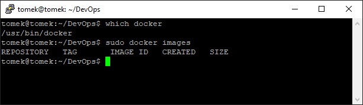
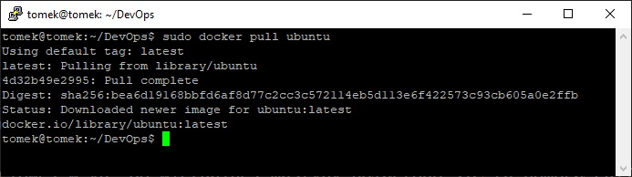
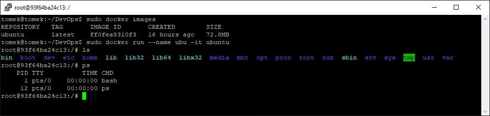
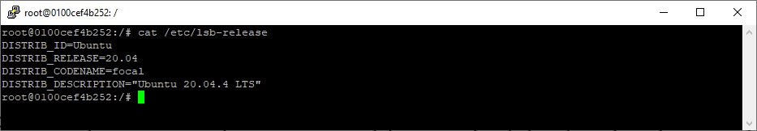
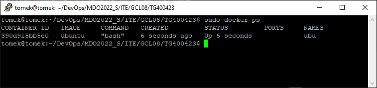
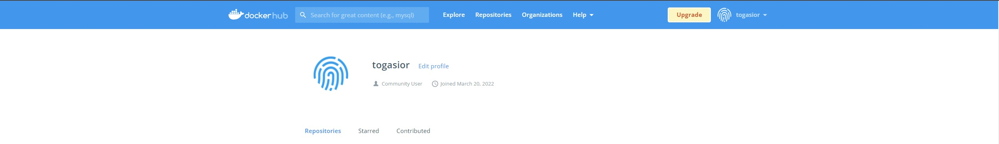

| Imie   | Nazwisko | Data       |
|--------|----------|------------|
| Tomasz | Gąsior   | 16.03.2022 |

# 1. Utworzenie hooka który uruchamia skrypty sprawdzające czy w ciągu znaków znajduję się TG400423 oraz Lab02
```bash
#!/bin/bash

param="$(cat $1)"

if [ -z "$param" ]
then
      echo "Empty parameter"
      exit 1
fi

source /home/tomek/DevOps/MDO2022_S/.git/hooks/name_validator $param
source /home/tomek/DevOps/MDO2022_S/.git/hooks/lab_validator $param

exit 0
```
Wywołanie skryptów za pomocą komendy source sprawia, że kiedy którykolwiek ze skryptów wykona exit 
główny skrypt również zakończy swoje działanie.

Wywoływane sktypty muszą posiadać odpowiednie uprawnienia.

# 2. Pierwszy skrypt sprawdza czy istnieje ciąg znaków TG400423
```bash

#!/bin/bash

if [[ "$1" =~ .*TG400423.* ]]; then

  echo "Poprawna nazwa TG400423"

else

  echo "Nie pada ciąg znaków TG400423"
  exit 1

fi

```
Jeśli ciąg znaków istnieje wyświetlany jest komunikat. Jeśli nie wykonywane jest exit 1 (skrypt wywołujący również kończy pracę)

# 3. Drugi skrypt sprawdza czy istnieje ciąg znaków Lab02
```bash
#!/bin/bash

if [[ "$1" =~ .*Lab02.* ]]; then

  echo "Poprawny lab"
  exit 0

else

  echo "Błędny numer labu"
  exit 1

fi

```
Jeśli istnieję ciąg znaków skrypt główny kończy pracę (exit 0) 

# 5 Przykład działania skryptu



# 6. Instalacja SSH i działanie SSH 

Zmieniono ustawienia karty sieciowej w vb. Do wirtualnej maszyny połączono się za pomocą PuTTY.

# 7. Instalacja Docker


# 8. Sprawdzenie poprawności instalacji


# 9. Sprawdzenie poprawności działania dockera (część praktyczna)


Pobranie obrazu ubuntu



Utworzenie oraz połączenie się z kontenerem (parametr -it tworzy połączenie do pseudo-TTY, --name pozwala nadać nazwę)



Wyświetlenie numeru wersji ubuntu



Wyświetlenie uruchomionych kontenerów z drugiego terminalu

# 10. Utworzenie konta na dockerhub

