| Imie   | Nazwisko | Data       |
|--------|----------|------------|
| Tomasz | Gąsior   | 23.03.2022 |

# 1. Utworzono program w C# który zawiera proste testy potrzebne do wykonania sprawozdania 

Program: [https://github.com/XxTomixX/GithubTestApp](https://github.com/XxTomixX/GithubTestApp)

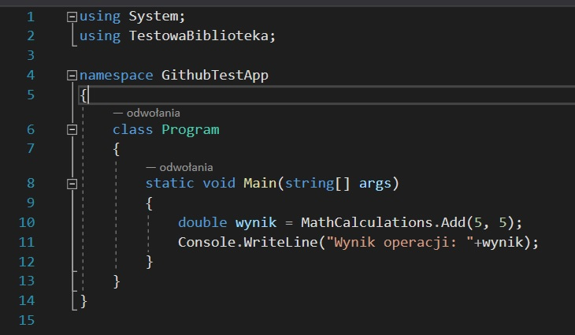

Biblioteka:

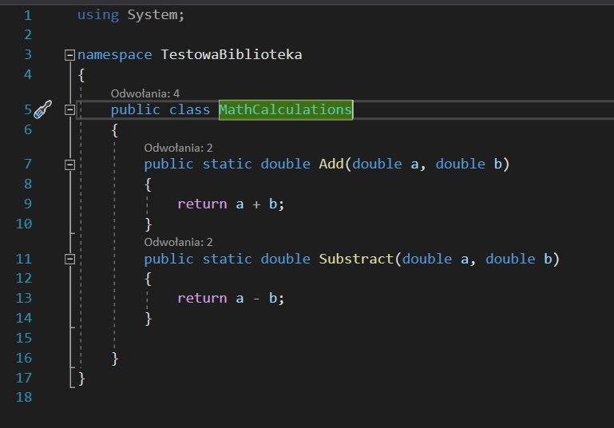

Testy:

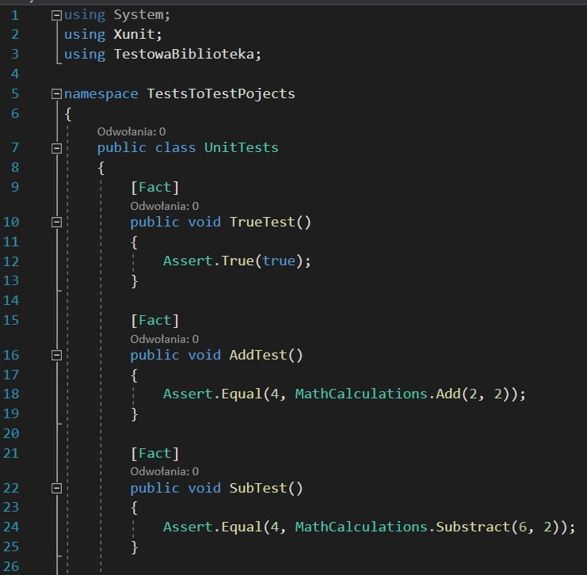

# 2. Wybór kontenera bazowego

Ubuntu zostało wybrane ponieważ wspiera platformę .NET oraz dzięki dokumentacji można w prosty sposób zainstalować .NET SDK
[https://docs.microsoft.com/en-us/dotnet/core/install/linux-ubuntu](https://docs.microsoft.com/en-us/dotnet/core/install/linux-ubuntu)

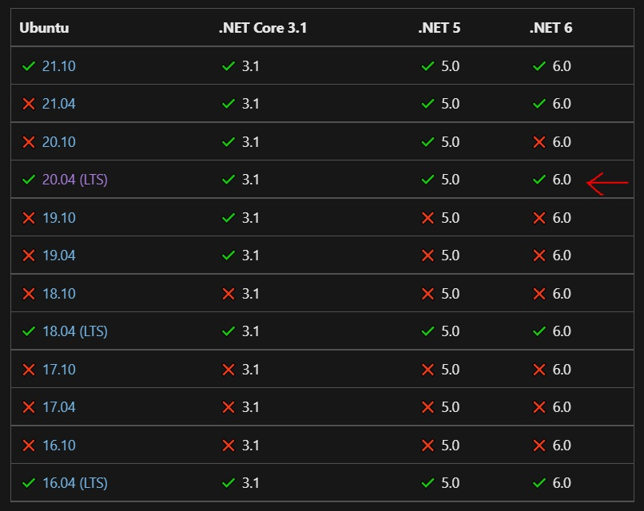

Wersja ubuntu używana na dokerze zaznaczona jest czerwoną strzełką.

# 2. Uruchomienie kontenera z podłączonym TTY

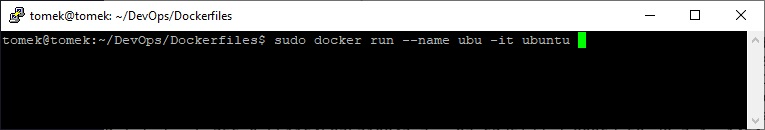

Ręczne zaopatrzenie go w wymagania wstępne (git,wget,.NET sdk,pobranie repozytorium) (pełna lista komend zamieszczona w dockerfile)

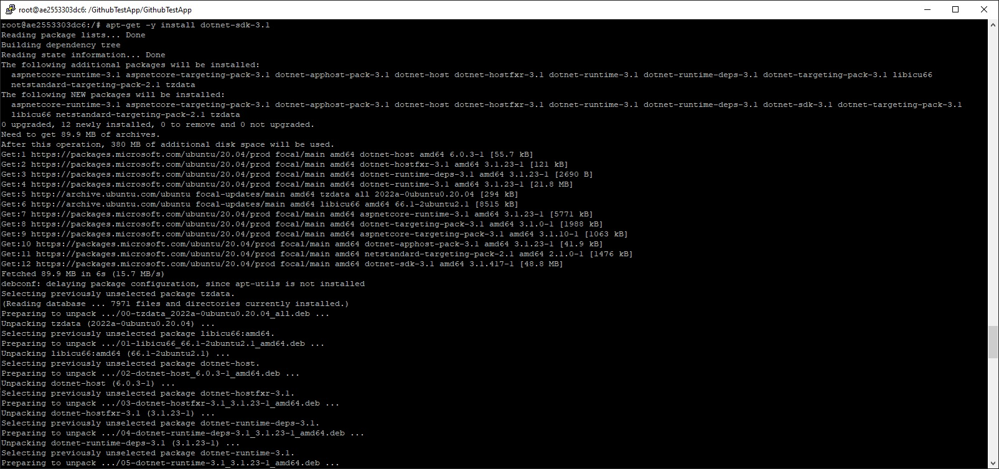

# 3. Pobranie repozytorium

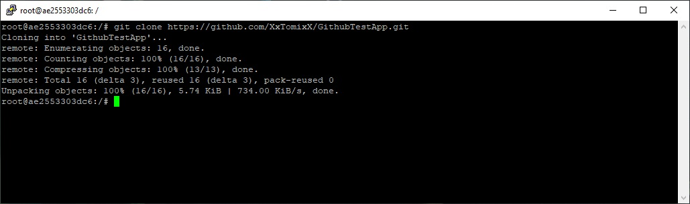

# 3. Ręczne uruchomienie budowania 

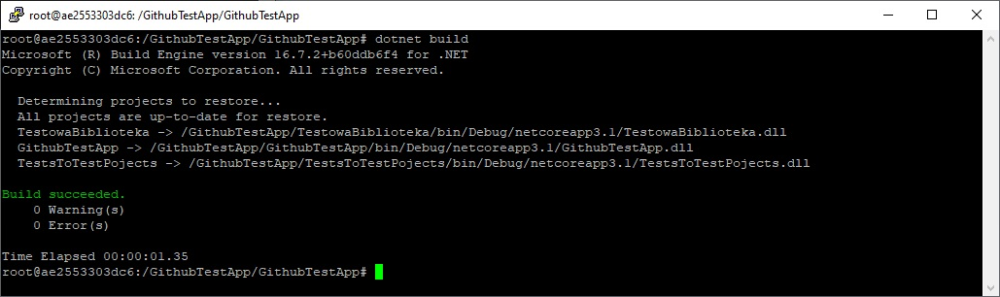

# 4. Ręczne uruchomienie testów

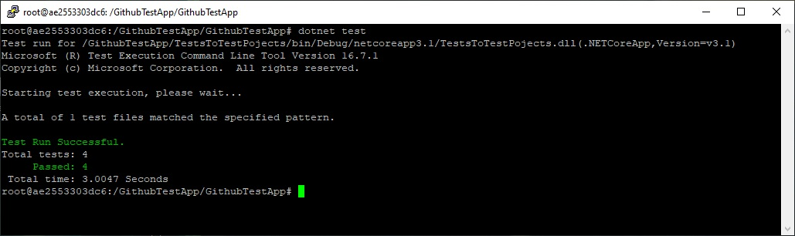

# 5. Tworzenie plików dockerfile 

Dockerfile wykonujący build programu.

```dockerfile
FROM ubuntu:latest

ARG DEBIAN_FRONTEND=noninteractive
RUN echo 'Building dotnet build image'

RUN apt-get -y update
RUN apt-get -y install git
RUN apt-get -y install wget

RUN wget https://packages.microsoft.com/config/ubuntu/20.04/packages-microsoft-prod.deb -O packages-microsoft-prod.deb
RUN dpkg -i packages-microsoft-prod.deb
RUN rm packages-microsoft-prod.deb

RUN apt-get update; \
  apt-get install -y apt-transport-https && \
  apt-get update && \
  apt-get -y install dotnet-sdk-3.1

RUN git clone https://github.com/XxTomixX/GithubTestApp.git
WORKDIR GithubTestApp/GithubTestApp
RUN dotnet build

```

Dockerfile tworzący obraz na podstawie obrazu build który będzie wykonywał testy.

```dockerfile
FROM build:latest
WORKDIR .
RUN dotnet test
```

# 6. Tworzenie obrazów na podstawie dockerfile

1. Tworzenie obrazu build wywołanie polecenia ```sudo docker build -t build:latest . -f ./Dockerfile-Build```

Screen przedstawia poprawne zbudowanie programu oraz utworzenie konkretnego obrazu docker.

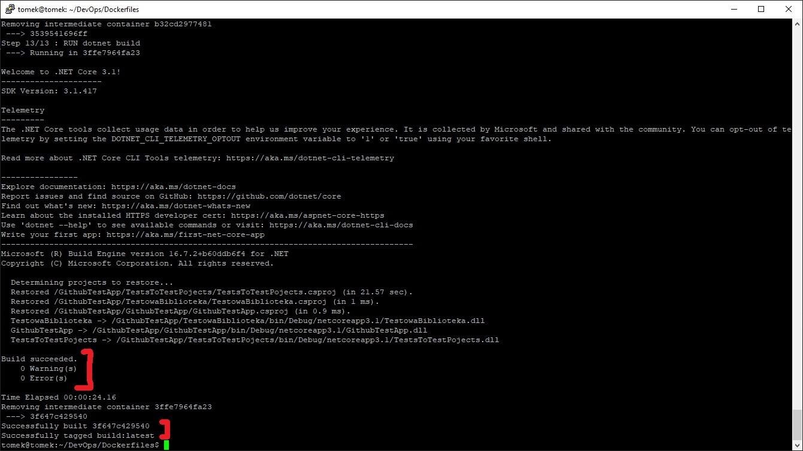


2. Tworzenie obrazu build wywołanie polecenia ```sudo docker build -t test:latest . -f ./Dockerfile-Test```

Screen przedstawia poprawne przedestowanie programu oraz utworzenie konkretnego obrazu docker.

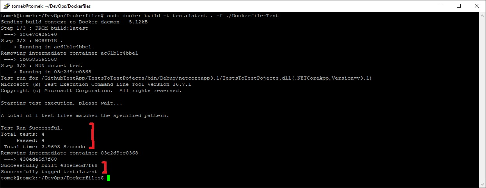

# 7. Utworzone docker images

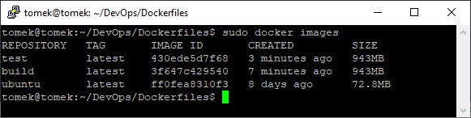

# 8. Utworzenie kontenerów z nowo powstałych obrazów

Kontener build (tworzony na podstawie obrazu build) pracuję poprawnie:

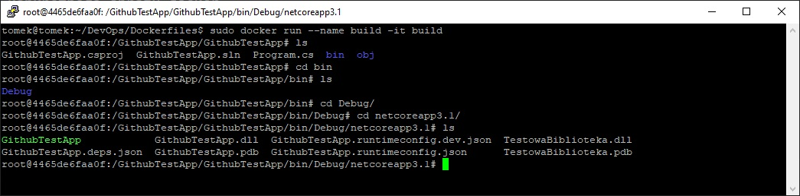

Kontener test (tworzony na podstawie obrazu test) pracuję poprawnie:

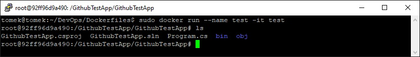

Pracujące kontenery: 

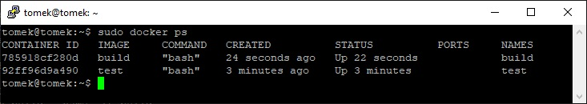

# 9. Tworzenie docker compose 

```docker
version: "3.3"
services:
  build:
    image: "build:latest"
  test:
    image: "test:latest"
```

# 10. Uruchomienie docker compose

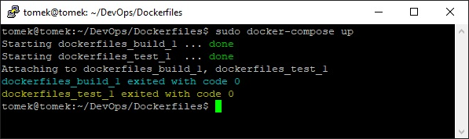

# 11. Dyskusja

Prosta biblioteka matematyczna raczej nie powinna byc publikowana jako kontener. 
Wdrażanie i publikacja jako kontener lepiej sprawdza się w przypadku serwisów świadczących jakieś usługi lub korzystających z innych usługach.
Dystrybucja biblioteki matematycznej może odbywać się za pomocą pakietu NuGet.

