| Imie   | Nazwisko | Data       |
|--------|----------|------------|
| Tomasz | Gąsior   | 03.04.2022 |

# Woluminy
# 1. Przygotowanie woluminów wejściowych i wyjściowych
```
sudo docker volume create in
sudo docker volume create out
sudo docker volume ls
```

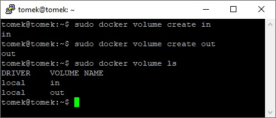

# 2. Uruchomienie kontenera z woluminami

```
sudo docker run -it --name ubu --mount source=in,target=/in --mount source=out,target=/out ubuntu
```

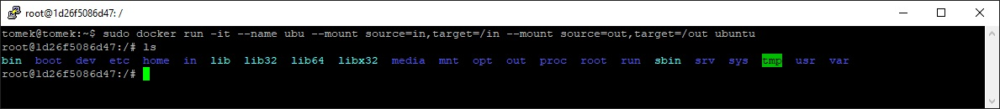

# 3. Sprawdzenie poprawności montowania woluminów

```
sudo docker inspect ubu
```
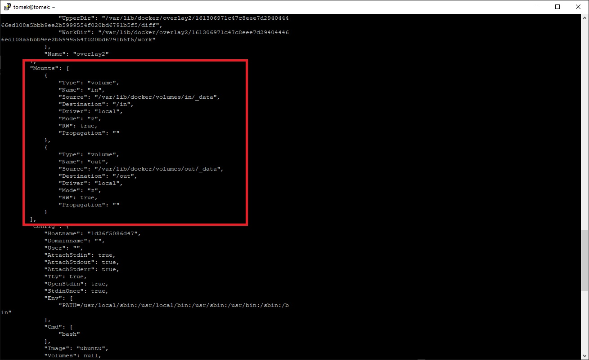

# 4. Instalacja wymagań wstępnych (tak jak w poprzednim sprawozdaniu)

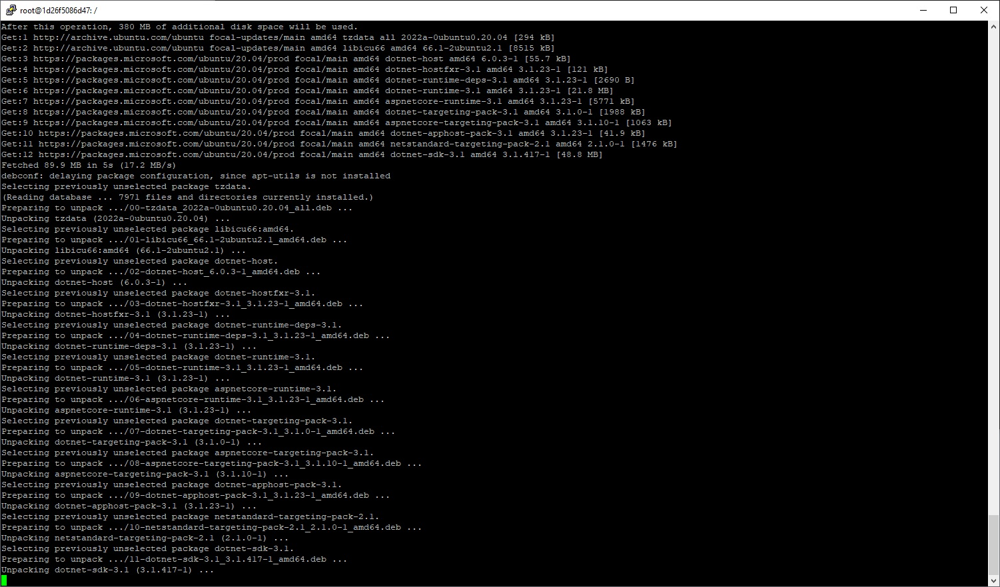

# 5. Klonowanie repozytorium na wolumin wejściowy
```
cd /var/lib/docker/volumes/in/_data/
git clone https://github.com/XxTomixX/GithubTestApp.git
```

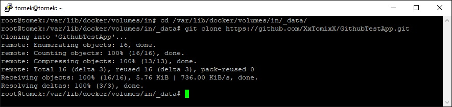

Repozytorium na woluminie podpiętym do kontenera

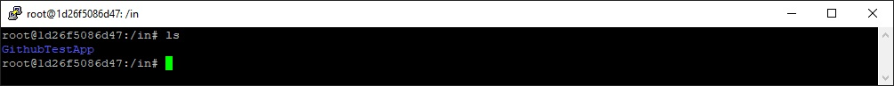

# 6. Uruchomienie build-a oraz zapisanie plików na woluminie wyjściowym

```
 dotnet build --output ../../../out/
 ```

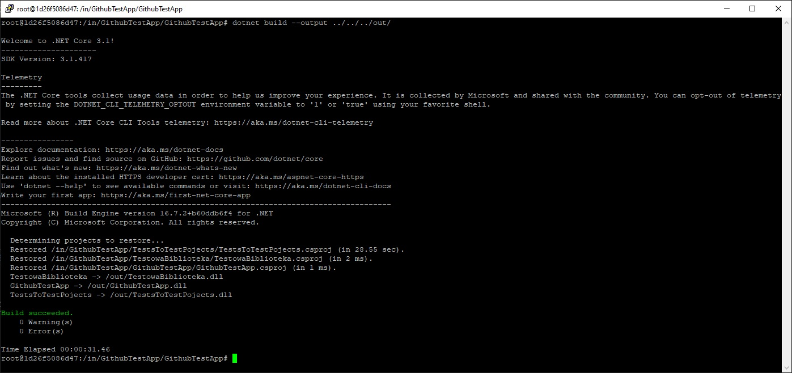

# 7. Pliki zapisane na woluminie 

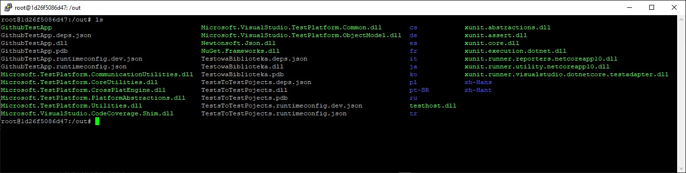

# 8. Stan woluminu wyjśowego po zakończeniu pracy kontenera 

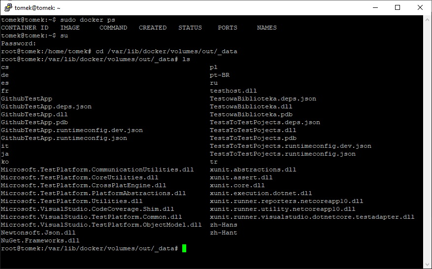

# Iperf

# 9. Pobranie obrazu z iperf3
```
sudo docker pull networkstatic/iperf3
```

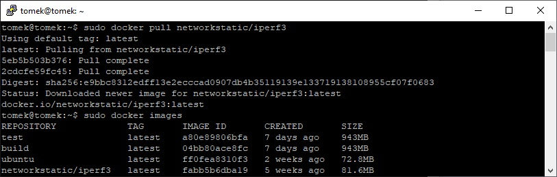

# 10. Uruchomienie serwera w kontenerze 
```
sudo docker run  -it --rm --name=iperf3-server -p 5201:5201 networkstatic/iperf3 -s
```

Argument -p pozwala wyeksponować wskazane porty 


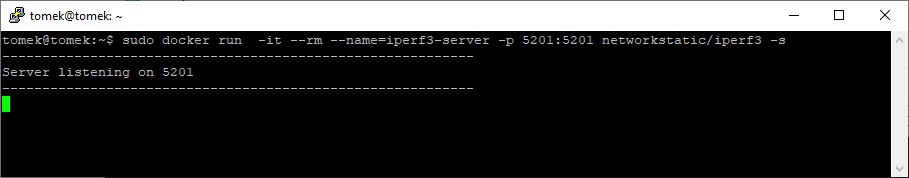

# 11. Sprawdzenie adresu serwera
```
sudo docker inspect iperf3-server
```
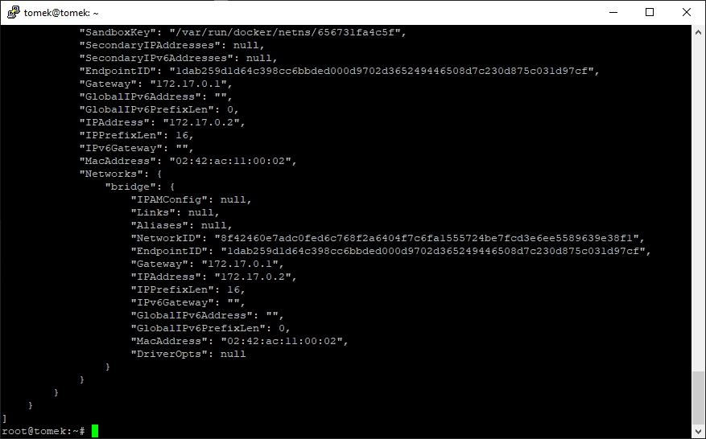

# 12. Przeprowadzenie badania kontener-kontener (serwer po lewej, klinet po prawej)


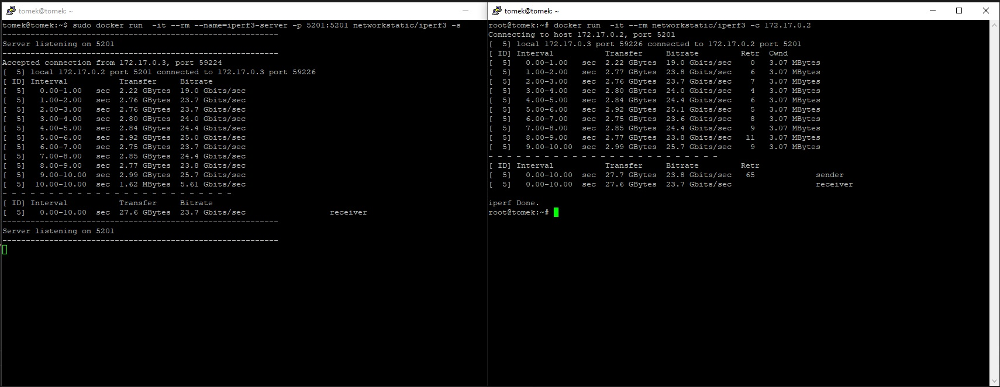

# 13. Przeprowadzenie badania kontener-host (serwer (kontener) po lewej, klinet (host) po prawej)

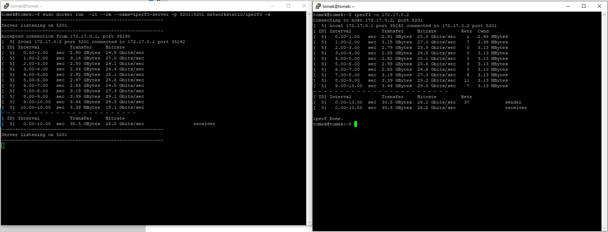

# 14. Przeprowadzenie badania kontener-poza host (serwer (kontener) po lewej, klinet (poza host) po prawej)

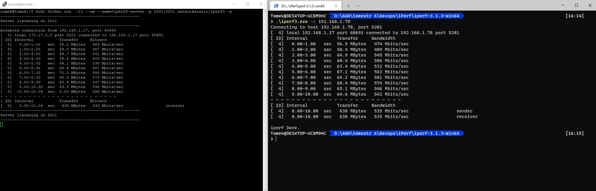

192.168.1.78 - adres vbox

172.17.0.2 - adres kontenera z serwerem iferf

# 15. Porównanie przepustowości 

| Typ   | Przepustowość | 
|--------|----------|
| kontener-kontener | 23.7 Gbits/s  | 
| kontener-host | 26.2  Gbits/s | 
| kontener-poza host | 533  Mbits/s | 

Najlepszą przepustowość uzyskono podczas testu kontener-host. 

Dzieję się tak ponieważ w takiej konfiguracji proces obsługjący kontener ma większy priorytet przez hostowanie serwisu.

# Jenkins

# 16. Utworzenie sieci 
```
docker network create jenkins
```

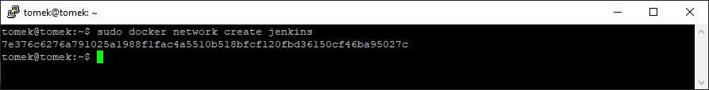

# 17. Pobranie i uruchomienie obrazu DIND

```
docker run \
  --name jenkins-docker \
  --rm \
  --detach \
  --privileged \
  --network jenkins \
  --network-alias docker \
  --env DOCKER_TLS_CERTDIR=/certs \
  --volume jenkins-docker-certs:/certs/client \
  --volume jenkins-data:/var/jenkins_home \
  --publish 2376:2376 \
  docker:dind \
  --storage-driver overlay2
```

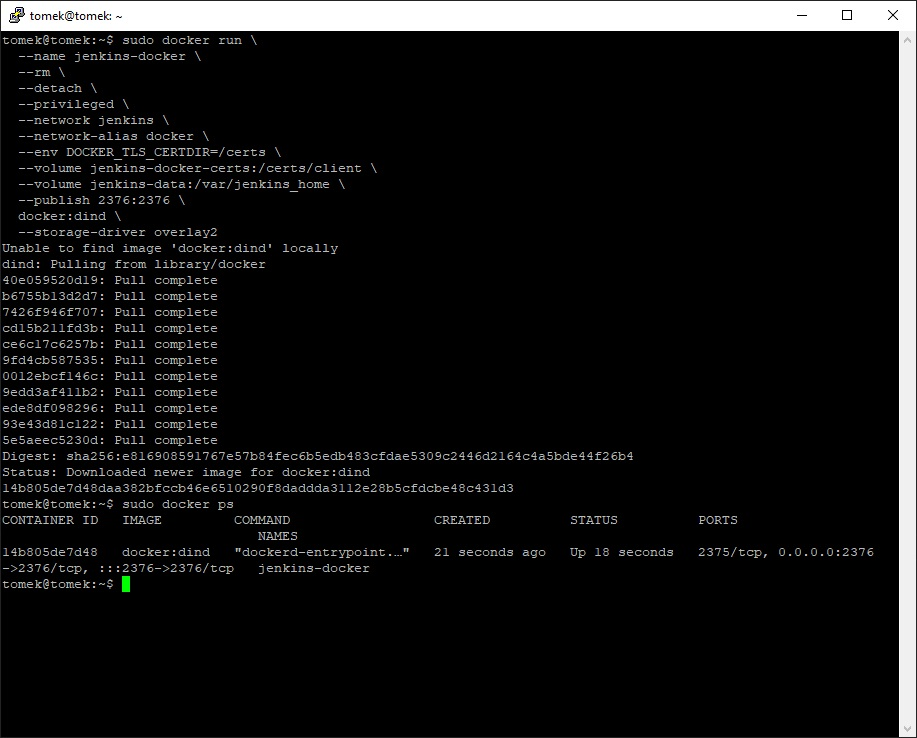

# 18. Stworzenie Dockerfile dla Jenkins

```dockerfile
FROM jenkins/jenkins:2.332.1-jdk11
USER root
RUN apt-get update && apt-get install -y lsb-release
RUN curl -fsSLo /usr/share/keyrings/docker-archive-keyring.asc \
  https://download.docker.com/linux/debian/gpg
RUN echo "deb [arch=$(dpkg --print-architecture) \
  signed-by=/usr/share/keyrings/docker-archive-keyring.asc] \
  https://download.docker.com/linux/debian \
  $(lsb_release -cs) stable" > /etc/apt/sources.list.d/docker.list
RUN apt-get update && apt-get install -y docker-ce-cli
USER jenkins
RUN jenkins-plugin-cli --plugins "blueocean:1.25.3 docker-workflow:1.28"
```


# 19. Stworzenie obrazu na podstawie Dockerfile

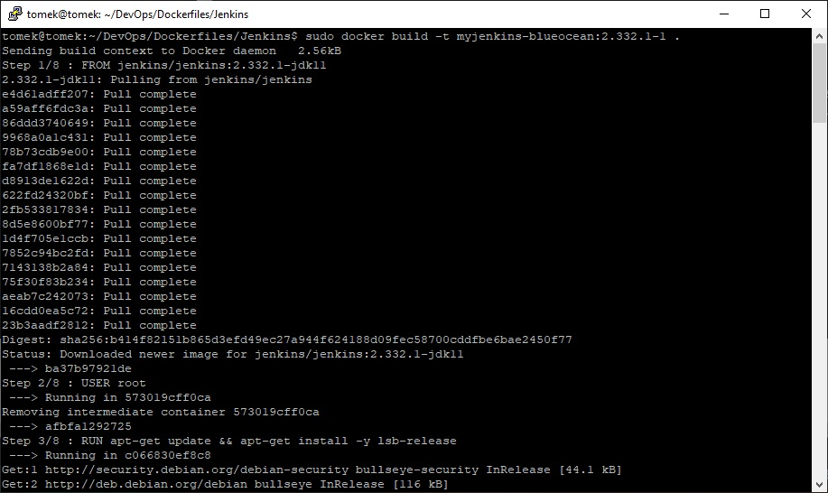

```
sudo docker images
```

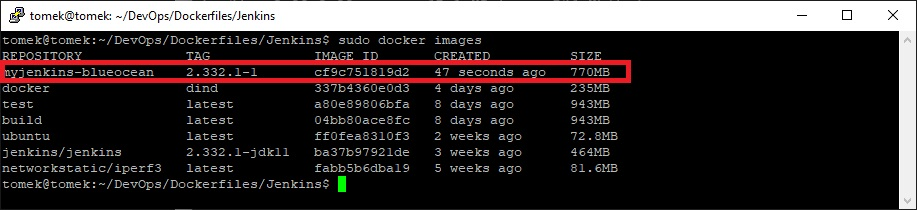

# 20. Uruchomienie kontenera 

```
docker run \
  --name jenkins-blueocean \
  --rm \
  --detach \
  --network jenkins \
  --env DOCKER_HOST=tcp://docker:2376 \
  --env DOCKER_CERT_PATH=/certs/client \
  --env DOCKER_TLS_VERIFY=1 \
  --publish 8080:8080 \
  --publish 50000:50000 \
  --volume jenkins-data:/var/jenkins_home \
  --volume jenkins-docker-certs:/certs/client:ro \
  myjenkins-blueocean:2.332.1-1 
```

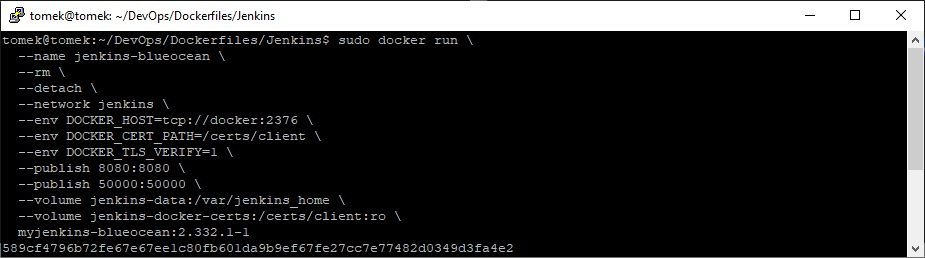

```
sudo docker ps
```

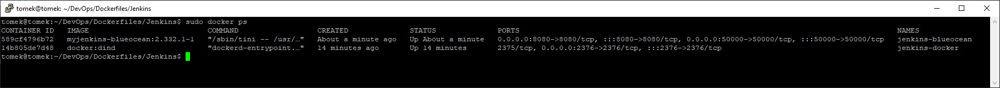


# 21. Odblokowanie Jenkins
```
sudo docker exec jenkins-blueocean cat /var/jenkins_home/secrets/initialAdminPassword
```
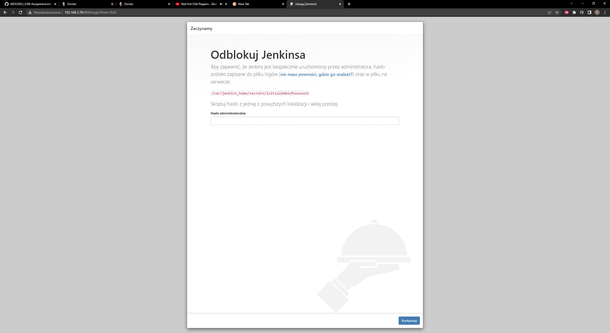

# 22. Udana instalacja, panel Jenkins

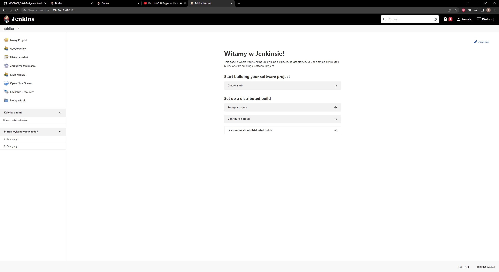
