| Imie   | Nazwisko | Data       |
|--------|----------|------------|
| Tomasz | Gąsior   | 10.05.2022 |

# Przygotowanie systamu pod uruchomienie 
Instalacja systemu\
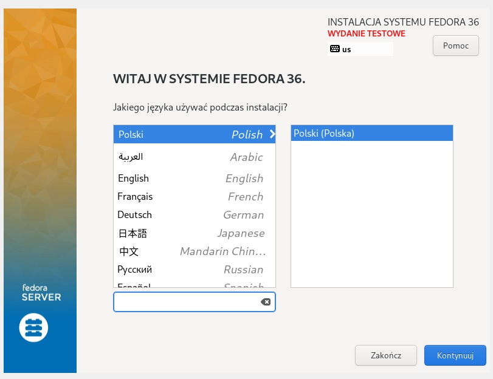

Partycjonowanie 

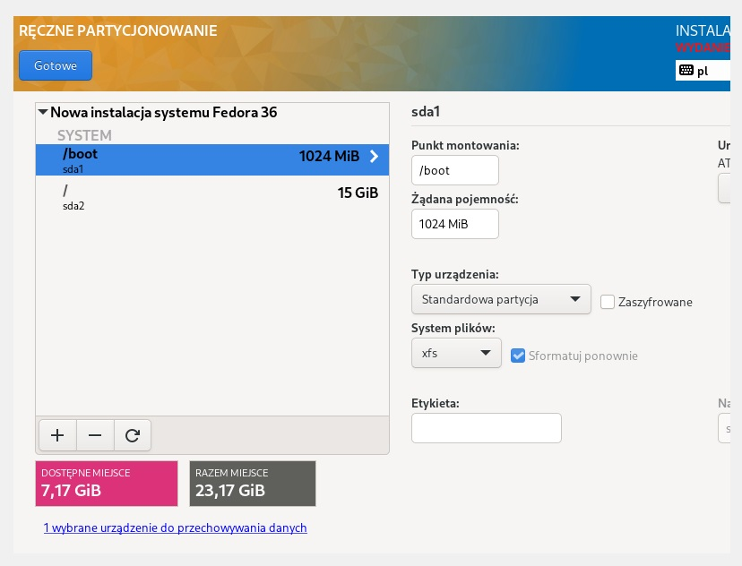

Z uwagi na automatyczne publikowanie paczki nuget przez pipeline na nuget gallery nie ma potrzeby przeprowadzania drugiej instalacji fedory.  

Po udanej instalacji zalogowano się na root-a i wykonano następujące komendy: 
 1. yum -y install nuget 
 2. yum -y install dotnet 
 3. cd home 
 4. nuget install Math_Lib

# Zakres rozszerzony
Utworzony pipeline zapisuję artefakt jako paczkę nuget na nuget.org \
Dokładny opis znajduję się w sprawozdaniu z projektu.

# Plik odpowiedzi 

```
# Generated by Anaconda 36.16.2
# Generated by pykickstart v3.36
#version=F36
# Use graphical install
graphical

# Keyboard layouts
keyboard --vckeymap=pl --xlayouts='pl'
# System language
lang pl_PL.UTF-8

# Repo
url --mirrorlist=http://mirrors.fedoraproject.org/mirrorlist?repo=fedora-$releasever&arch=x86_64
repo --name=updates --mirrorlist=http://mirrors.fedoraproject.org/mirrorlist?repo=updates-released-f$releasever&arch=x86_64

%packages
@^server-product-environment
nuget
dotnet
%end

# Run the Setup Agent on first boot
firstboot --enable

# Generated using Blivet version 3.4.3
ignoredisk --only-use=sda
# Partition clearing information
clearpart --none --initlabel
# Disk partitioning information
part /boot --fstype="xfs" --ondisk=sda --size=1024
part / --fstype="xfs" --ondisk=sda --size=15360

# System timezone
timezone Europe/Warsaw --utc

# Root password
rootpw --iscrypted $y$j9T$j68IcjL8TRRmCaCJPXfWHVIc$dVgT.YHWy.R4r0dynus27uKFIeiFye0D15GX0RZsr41

# Post
%post
nuget install Math_Lib

%end
```
W sekcji packages dodano paczki nuget oraz dotnet. \
Dodano sekcję post w której pobierana jest paczka nuget. \
Dodano repozytoria fedory. 

Instalacja odbywa się w trybie graficznym. Pomogło to w identyfikacji błędów podczas instalacji \
(Podczas instalacji tekstowej instalator po prostu się zawieszał, graficzna instalacja pomogła zidentyfikować błąd). \
Można wykonać tekstową instalację zamieniając linijkę graphical na text. \

Zawieszony instalator w trybie tekstowym \
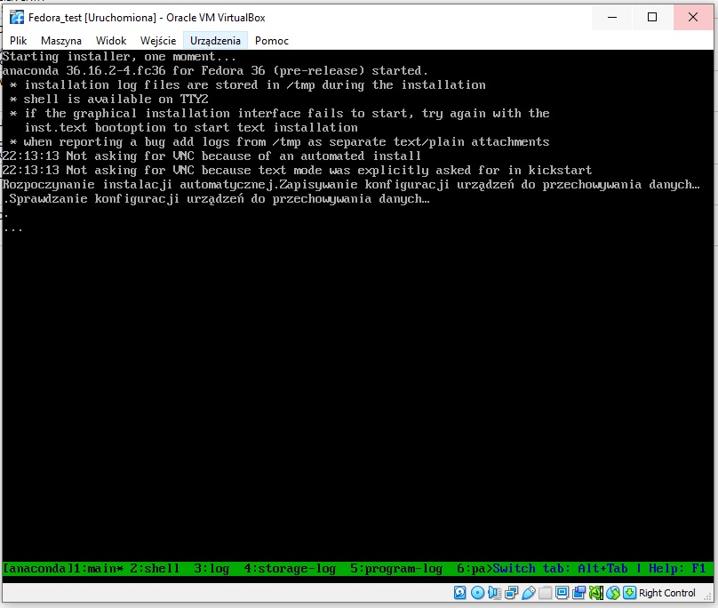

# Podłączenie pliku konfiguracyjnego znajdującego się na githubie
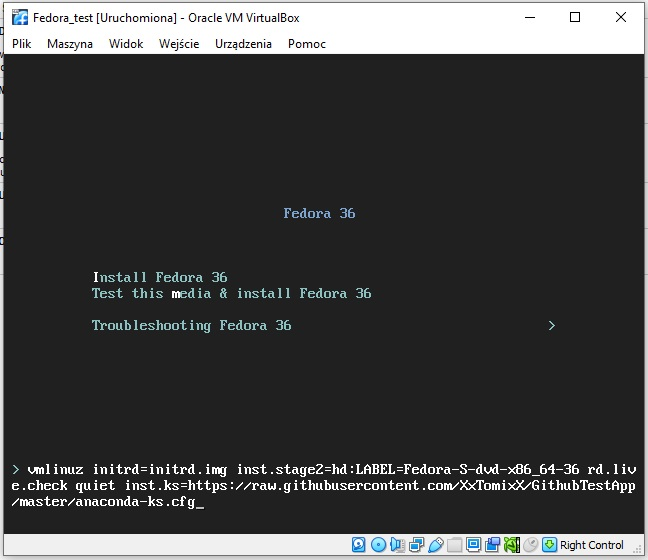

Plik musi być pobrany w formie raw (plik)

# Udana instalacja z podłączonym plikiem .cfg
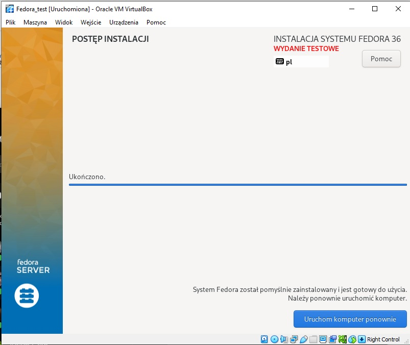

# Stan maszyny po instalacji

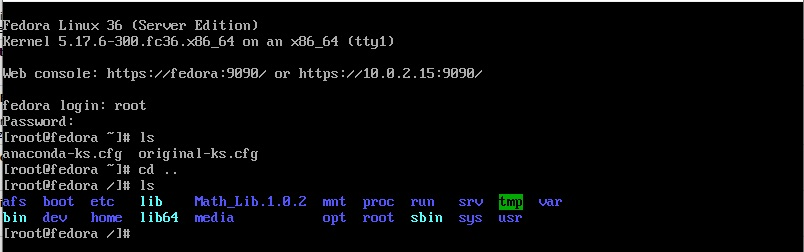

W katalogu domowym root-a pojawiły się pliki anaconda-ks.cfg oraz original-ks.cfg. \
Paczka nuget zainstalowana jest w / 


Prawa do odczytu paczki powinni mieć wszyscy użytkownicy \
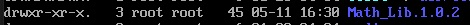

# Dodanie .cfg do iso 
Wykonano na podstawie: \
https://access.redhat.com/documentation/zh_cn/red_hat_enterprise_linux/6/html/installation_guide/s1-kickstart2-putkickstarthere

http://www.softpanorama.org/Commercial_linuxes/RHEL/Installation/Kickstart/modifing_iso_image_to_include_kickstart_file.shtml#n20210217X_how_can_we_create_a_customized_golden_image_or_rhel_iso_with_kickstart_file

1. Dodanie pliku .cfg \
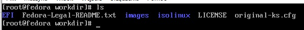

2. Modyfikacja isolinux.cfg \
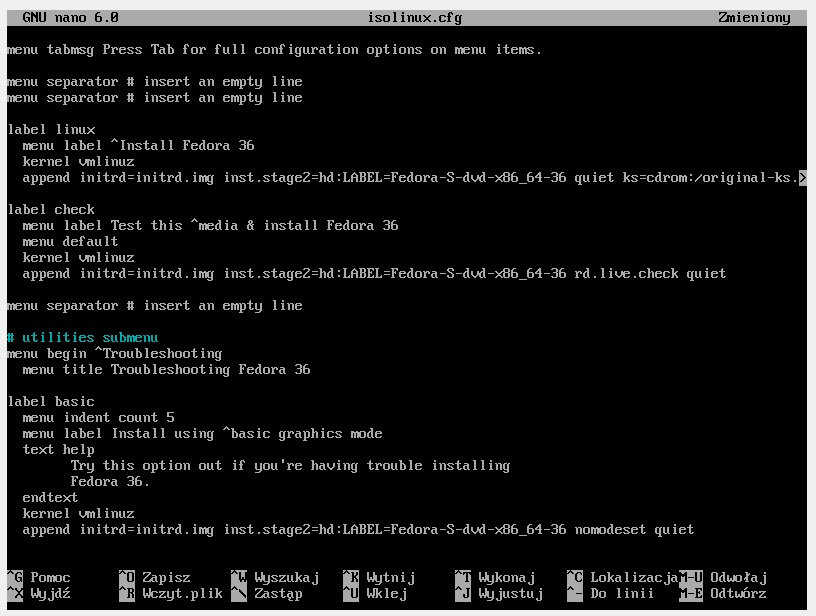

3. Tworzenie iso \
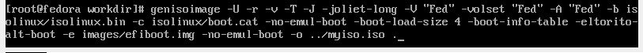

4. Wynik polecenia genisoimage \
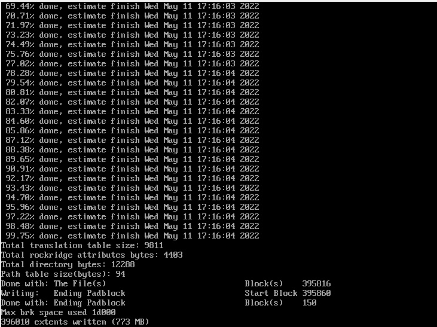

5. Utworzone iso \
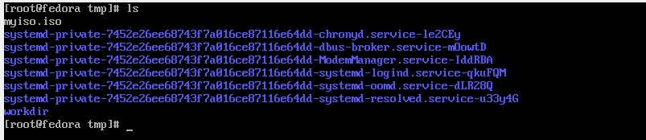

