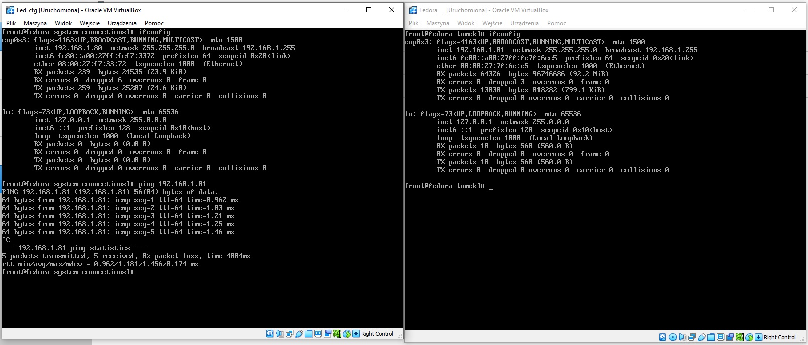
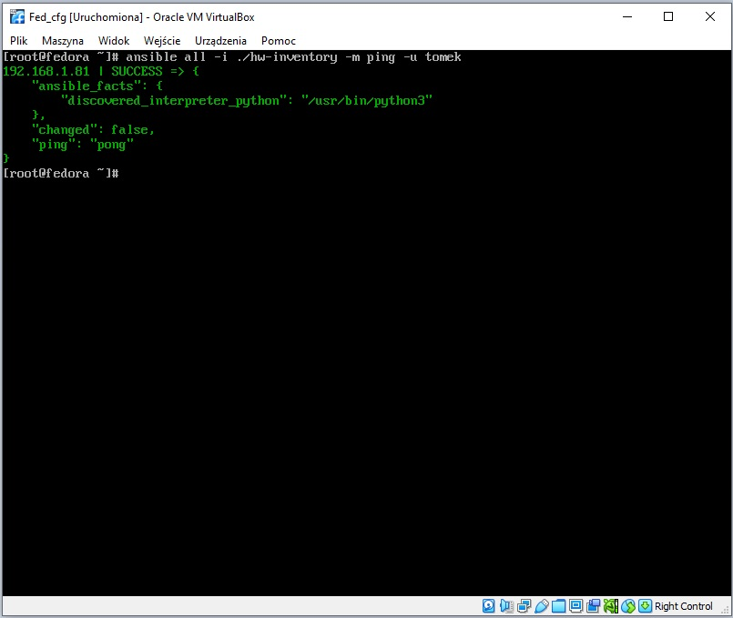
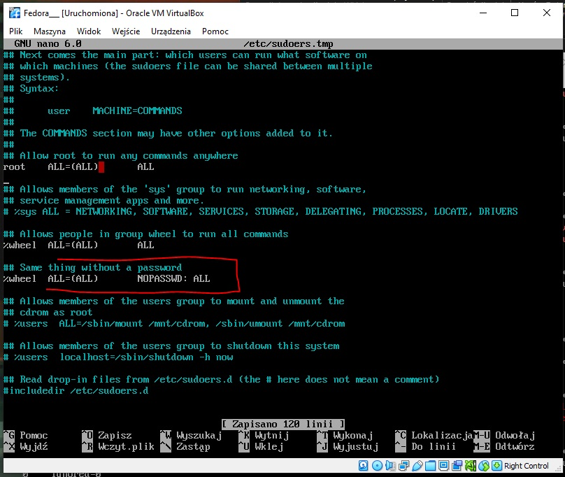
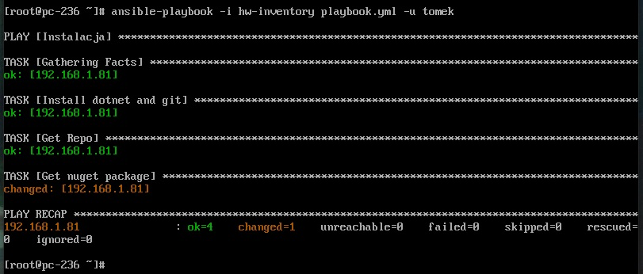

| Imie   | Nazwisko | Data       |
|--------|----------|------------|
| Tomasz | Gąsior   | 25.05.2022 |

# Przygotowanie systamu do wdrożeń

1. Dwie maszyny wirtualne w tej samej sieci (maszyny z popredniego ćwiczenia)



2. Utworzenie klucza, przekazanie go na node (doinstalowwano server vsftpd oraz przesłano pliki)

Ansible dodanie klucza na podstawie linku:\
https://medium.com/openinfo/ansible-ssh-private-public-keys-and-agent-setup-19c50b69c8c

3. Wykonanie pingu 



4. Z uwagi na to że użytkownik na "kliencie" musi korzystać z sudo, każdy użytkownik w grupie sudoers nie musi podawać hasła. (użytkownik tomek znajduję się w grupie wheel)



5. Utworzenie playbook-a pobierającego: git-a, środowisko dotnet, nuget, repozytorium oraz paczkę nuget


```yml
---
- name: Instalacja
  hosts: all
  become: true
  become_method: sudo  
  tasks:
    - name: Install dotnet and git 
      ansible.builtin.yum: 
        name: 
          - apt-transport-https
          - dotnet-runtime-3.1
          - nuget 
          - git
        state: present
    - name: Get Repo
      ansible.builtin.git:
        repo: https://github.com/XxTomixX/GithubTestApp
        dest: /var/repo
    - name: Get nuget package
      ansible.builtin.command:
        cmd: nuget install Math_Lib
        creates: /var/package
```
6. Utworzenie pliku hw-inventory (adres ip odczytany z komendy ip a) 
```
192.168.1.81
```

7. Uruchomienie ansible, instalacja przeprowadzana na kliencie 



Ostatni krok widnieje jako changed ponieważ poprzednie kroki zostały już wcześniej wykonane.

8. Poprawnie pobrana paczka nuget


