| Imie   | Nazwisko | Data       |
|--------|----------|------------|
| Tomasz | Gąsior   | 31.05.2022 |

# Kubernetes

1. Instalacja minikube

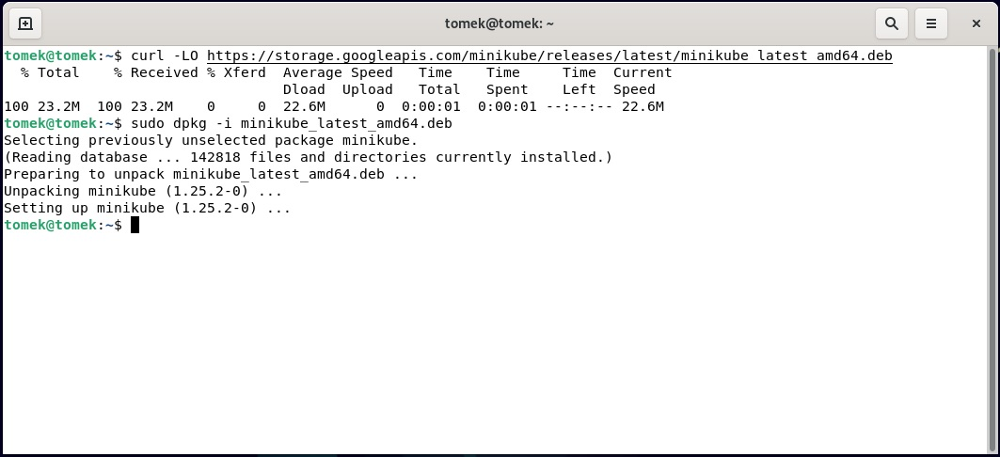

```
curl -LO https://storage.googleapis.com/minikube/releases/latest/minikube_latest_amd64.deb
sudo dpkg -i minikube_latest_amd64.deb
```

2. Pobranie kubectl


```
curl -LO "https://dl.k8s.io/release/$(curl -L -s https://dl.k8s.io/release/stable.txt)/bin/linux/amd64/kubectl"
```

Pobranie pliku z sumą kontrolną.

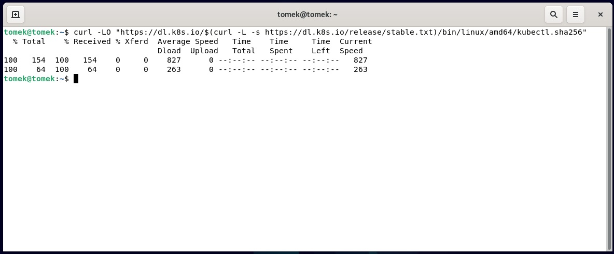

```
curl -LO "https://dl.k8s.io/$(curl -L -s https://dl.k8s.io/release/stable.txt)/bin/linux/amd64/kubectl.sha256"
```

Sprawdzenie instalacji z plikiem sumy kontrolnej.

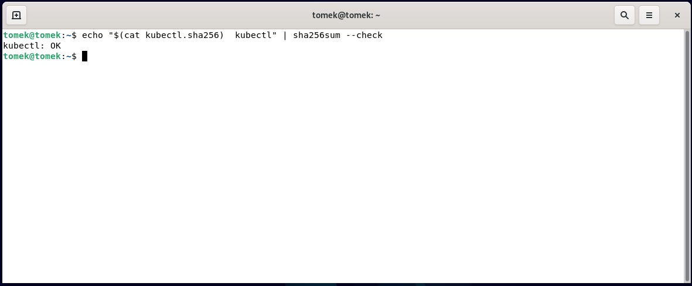

```
echo "$(cat kubectl.sha256)  kubectl" | sha256sum --check
```

Instalacja kubectl

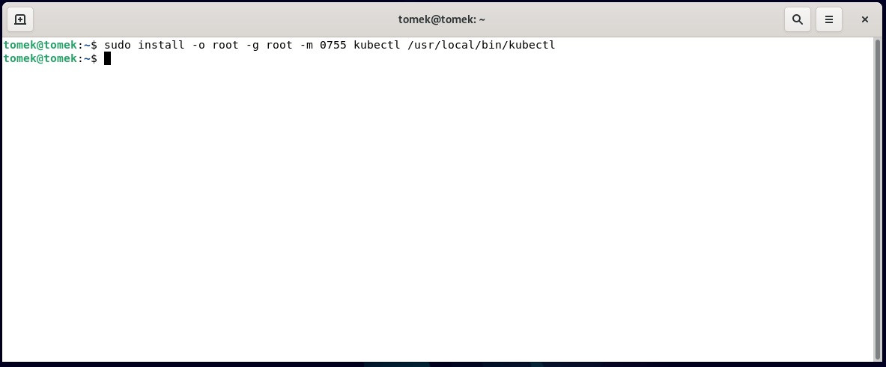

Sprawdzenie instalacji

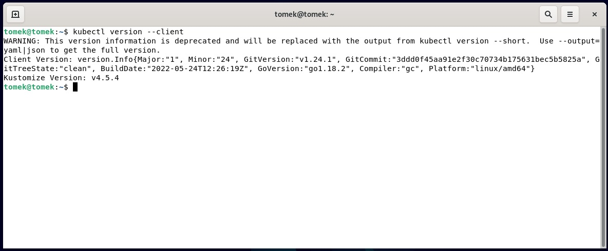

3. Dodanie użytkownik i docker do sudoers

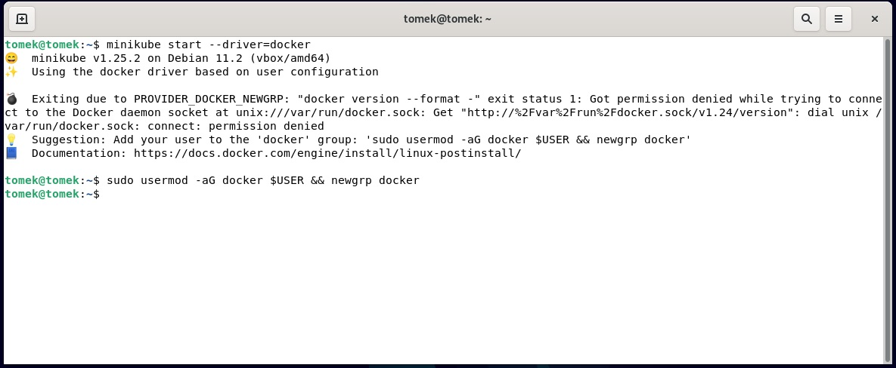

4. Uruchomienie minicube

```
minikube start
```

5. Ustawienie minimalnej ilości rdzeni 

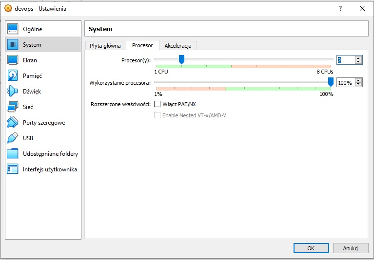


6. Uruchomienie minikube

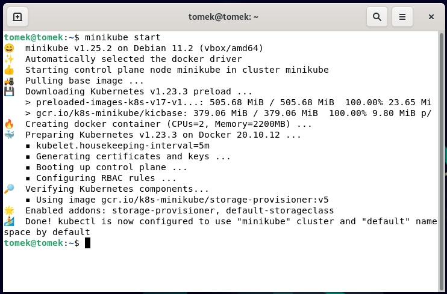

7. Uruchomienie dashboard 

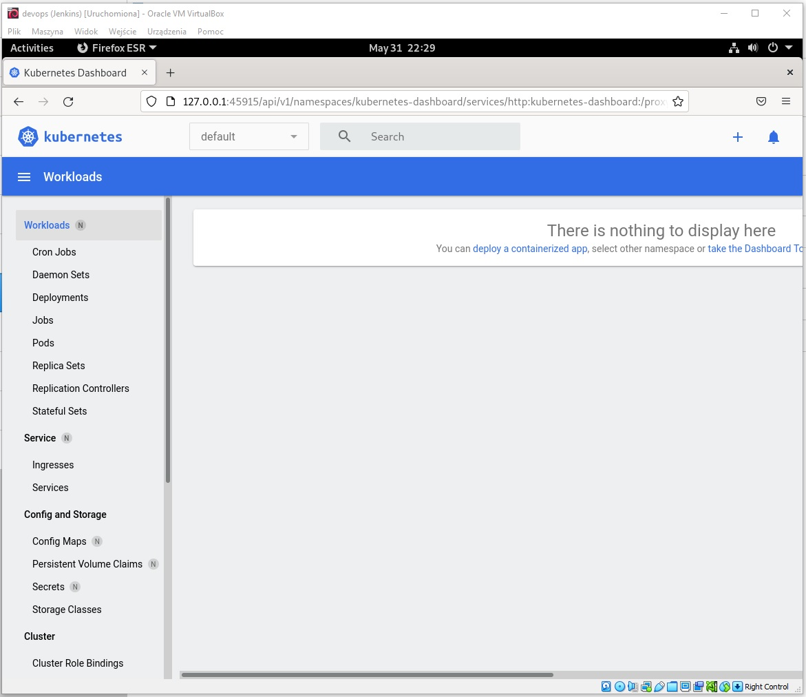

8. Uruchomienie nginx (projekt z pipeline nie udostępnia portów, użyto obrazu z dockerhub)

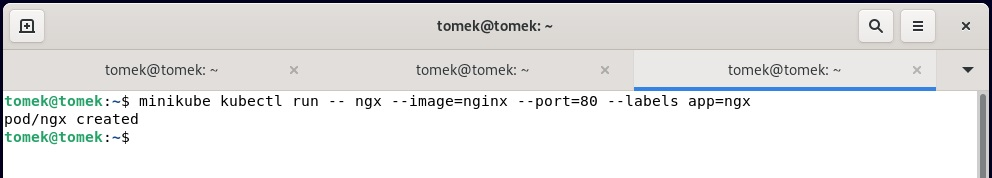

9. Działający pod

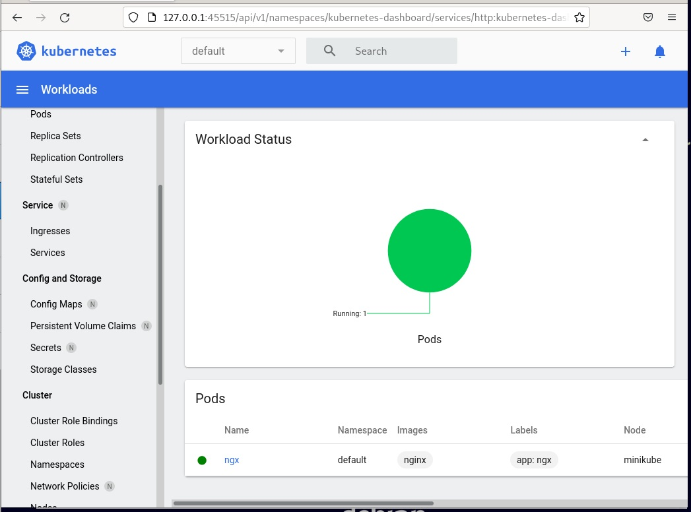

10. Port forwarding

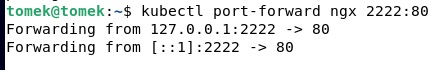

11. Działająca aplikacja


12. Plik wdrożenia 

```yaml
apiVersion: apps/v1
kind: Deployment
metadata:
  name: nginx-deployment
spec:
  selector:
    matchLabels:
      app: nginx
  replicas: 2
  template:
    metadata:
      labels:
        app: nginx
    spec:
      containers:
      - name: nginx
        image: nginx
        ports:
        - containerPort: 80

```

13. Wynik pliku wdrożeniowego

