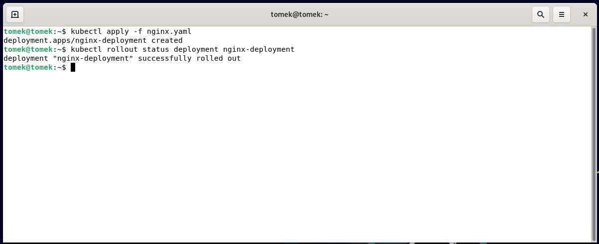
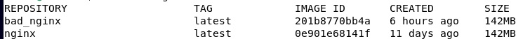
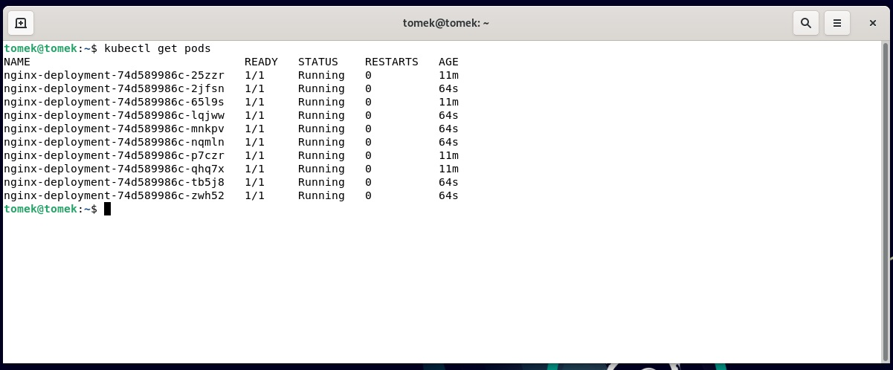
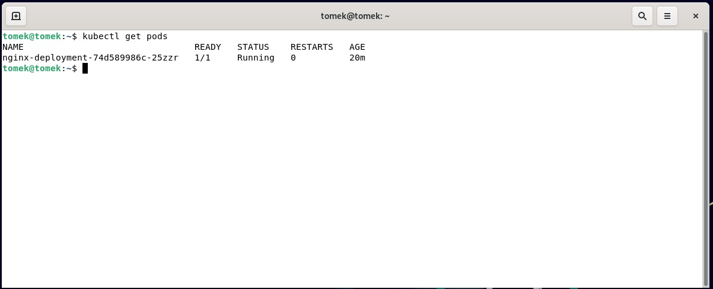
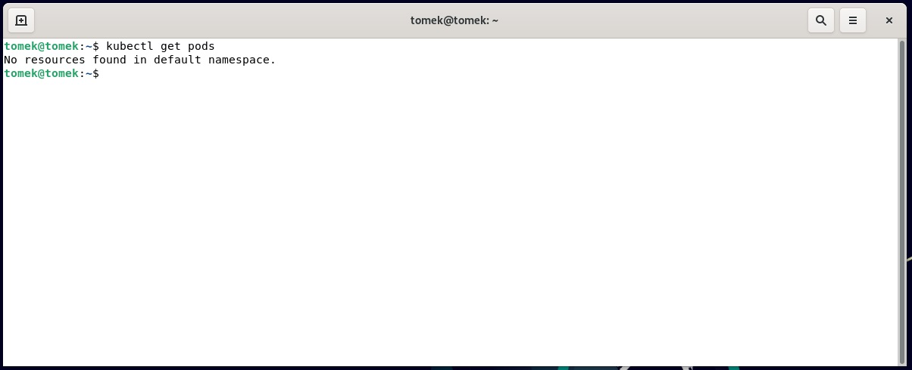
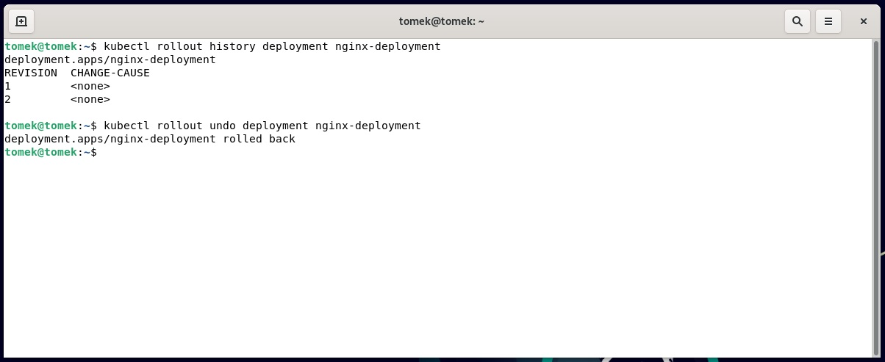

| Imie   | Nazwisko | Data       |
|--------|----------|------------|
| Tomasz | Gąsior   | 08.06.2022 |

# Kubernetes 2 

1. Plik yaml z poprzednich zajęć 

```yaml
apiVersion: apps/v1
kind: Deployment
metadata:
  name: nginx-deployment
spec:
  selector:
    matchLabels:
      app: nginx
  replicas: 2
  template:
    metadata:
      labels:
        app: nginx
    spec:
      containers:
      - name: nginx
        image: nginx
        ports:
        - containerPort: 80

```

Zwiększenie ilości replik do 4

```yaml
apiVersion: apps/v1
kind: Deployment
metadata:
  name: nginx-deployment
spec:
  selector:
    matchLabels:
      app: nginx
  replicas: 4
  template:
    metadata:
      labels:
        app: nginx
    spec:
      containers:
      - name: nginx
        image: nginx
        ports:
        - containerPort: 80

```

2. Wdrożenie za pomocą ```kubectl apply nginx.yaml```. Zbadanie stanu kubectl ```rollout status deployment nginx-deployment```. Plik nginx.yaml znajduję się w pliku Lab11.



3. Przygotowanie nowego obrazu.
- Wersja dobra: obraz nginx (nazwa nginx)
- Wersja zła: obraz na podstawie nginx (nazwa bad_nginx)



Dockerfile złego obrazu 

```Dockerfile
FROM nginx:latest
CMD [ "exit", "1" ]
```

4. Zwiększenie ilości replik 
```
 replicas: 10
```



5. Liczba replik równa 1
```
 replicas: 1
```



6. Liczba replik równa 0
```
 replicas: 0
```



7. Zastosowanie nowej wersji obrazu
```
 image: nginx
```

8. Zastosowanie złej wersji obrazu
```
 image: bad-nginx
```

9. Przywracanie poprzednich wersji wdrożenia 

```
kubectl rollout history deployment nginx-deployment
kubectl rollout undo deployment nginx-deployment
```



Po tej operacji wirtualna maszyna przestała działać. Próby uruchomienia maszyny nie przynosiły skutku.
Błędy podczas bootowania systemu.

10. Opis strategi wdrożenia:

# Recreate:
  Wszystkie pody są zabijane przed powstaniem nowych.\
# Rolling Update:
  Krokowe aktualizowanie następnych podów. Taka strategia zapewnia ciągłość działania aplikacji.\
# Canary Deployment workload:
  Jedna z metod blue,green. Nowa wersja aplikacji jest wdrażana obok starej. Jeśli wersja "dobrze sobie radzi" poprzednia wersja\
  jest wygaszana a ruch przekierowywany jest do podów wersji wyższej. 
