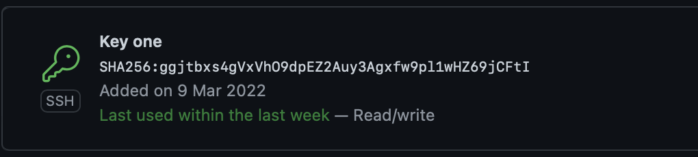

# Krystian Zapart - Lab 01 DevOps

## Sklonowanie repozytorium 

## Utwony klucz w git

 Klucz został wygenerowany komendą ssh-keygen -t rsa

## Utworzenie własnego branch'a

## Utworzenie odpowiedniej struktury folderów

