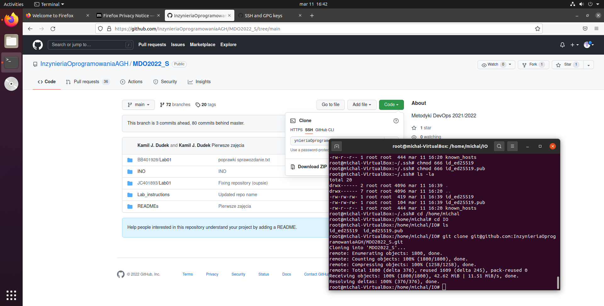
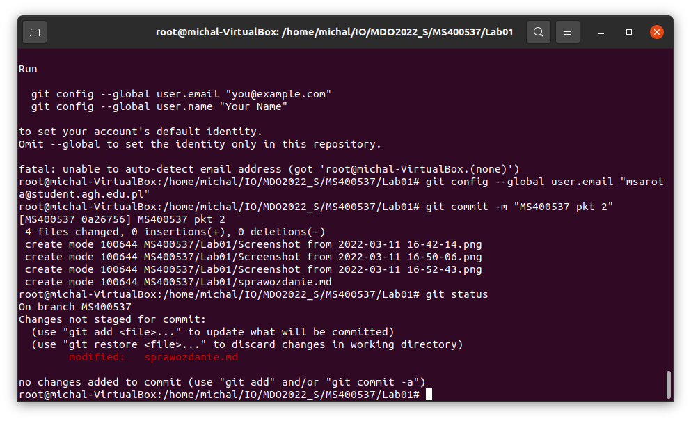

Sprawozdanie Michal Sarota 400537 11.03.2022

2.

Generacja klucza
`` ssh-keygen -t ed25519 -f id_ed25519``

Dodawanie klucza
`` ssh-add ~/.ssh/id_ed25519``

Klonowanie repozytorium

``git clone git@github.com:InzynieriaOprogramowaniaAGH/MDO2022_S.git ``

3.

