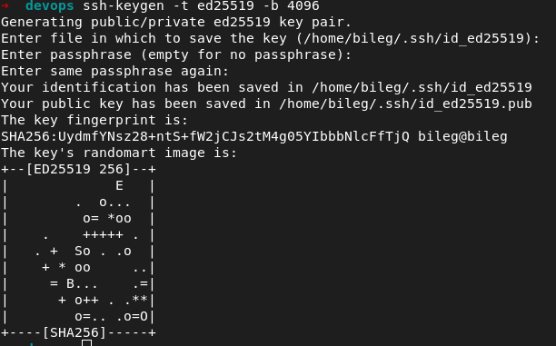
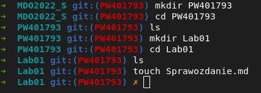

# Lab 01 - Paweł Waresiak

### Pobranie repo poprzez HTTPS

### Utworzenie klucza algorytmem ED25519

### Utworzenie klucza algorytmem DSA

### Dodany klucz do konta na GH

### Pobranie repo po ssh

### Utworzenie nowego brancha :joy:

### Utworzenie struktury katalogówi :punch:

