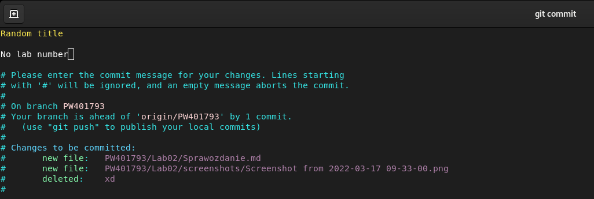
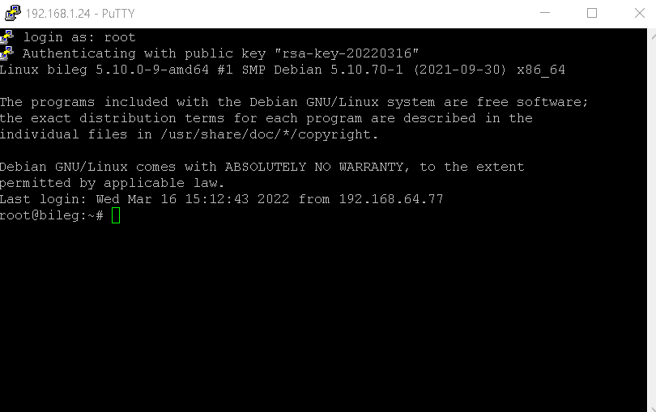
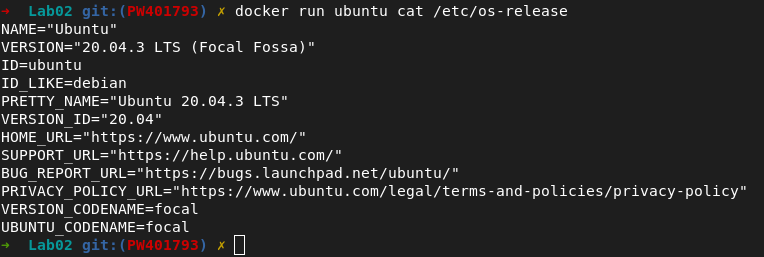

# Lab 02 - Paweł Waresiak

### Sprawdzenie czy git hook działa

#### Zły commit msg i body

#### Próba commitu

#### Dobry commit

#### Próba nr 2

### Połączenie się z maszyną po SSH przez Putty 

### Zainstalowanie dockera (ja już miałem, dowód że jest)

### Uruchomienie kontenera z Ubuntu

### Wersja Ubuntu z obrazu

### Konto na Docker Hub

