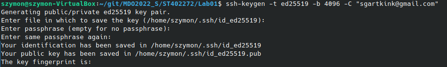
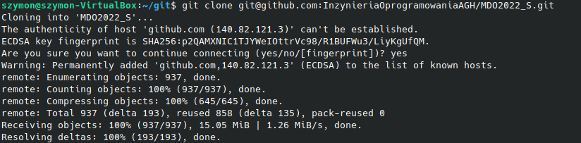
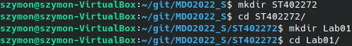

# Szymon Twardosz - Lab 01 DevOps

## Sklonowanie repozytorium za pomoca HTTPS

## Utworzenie klucza algorytmem RSA

## Utworzenie klucza algorytmem ED25519

## Sklonowanie repozytorium za pomoca SSH

## Utworzenie nowej galezi i przelaczenie sie na nia

## Utworzenie odpowiedniej struktury katalogow

