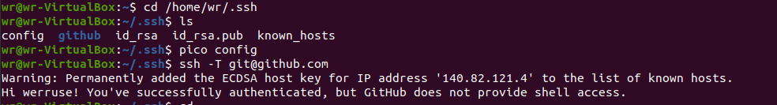

Sprawozdanie LAB01 Weronika Rusinek 403038

1. Instalacja Git i obsługa SSH: sudo apt install git

2. Klonowanie SSH: git clone git@github.com:InzynieriaOprogramowaniaAGH/MDO2022_S.git

3. Przełączanie między gałęziami: git checkout main, git checkout ITE-GCL07
4. Tworzenie nowej gałęzi: git branch WR40303

